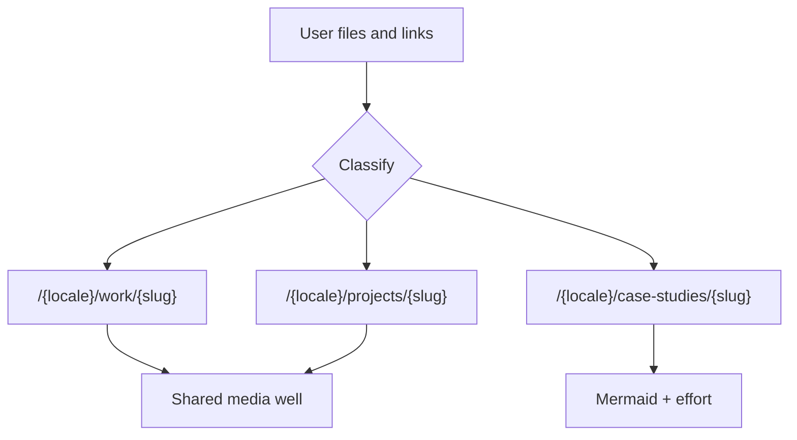

# Content fulfillment playbook

Canonical instructions for putting work on this site. When the user drops links, PDFs, screenshots, or notes and asks to publish them, follow this file.

Do **not** put custom agent rules in `AGENTS.md` — Next.js regenerates that file.

## When this applies

The user provides source material (files, URLs, short notes) and wants it on the site. Classify the drop, extract a summary, save media locally, write bilingual copy, and wire it into content modules. If a needed page type or media component does not exist yet, **build it in the same change**.

## Classify

Prefer the type the user named. Otherwise:

| Signal | Type |
| --- | --- |
| Client / job / commissioned visual work, PDF decks, Dribbble shots, motion reels | **Portfolio** |
| Deep process, constraints, outcomes, “how we got there” | **Case study** |
| Personal / side product, existing pet-project slug | **Pet project** |

Home stays Experience + Pet projects until the first Portfolio or Case study item lands. Then add the matching home section and nav.



## Global rules

- **Locales:** every user-facing string is `en` and `by`. Match existing voice in [`content/projects.ts`](content/projects.ts) and [`content/experience.ts`](content/experience.ts): product-first, concise, no filler, no marketing superlatives.
- **Summarize.** Do not dump source text onto the page. Keep original article URLs as citations / further reading.
- **Media lives in `public/`.** Download images. Do not hotlink Dribbble, OG images, or CDNs. YouTube is the only embed exception (privacy-enhanced iframe).
- **NDA:** if `stage === "nda"` (or the user says it is confidential), no public detail route, no extracted media, no quotes from the source. Grid card stays private (ASCII noise pattern).
- **Pet projects** stay preview-only until [`lib/site-url.ts`](lib/site-url.ts) changes. Do not leak them onto production.
- **Visual language:** `max-w-5xl`, `rounded-2xl`, `border-border`, Geist, `text-muted` / `text-foreground`. Prefer scroll-snap over a carousel library.
- **Missing UI:** implement the primitive in the same PR. Do not leave “TODO: add carousel later.”

## File map (create on first use)

| Path | Role |
| --- | --- |
| [`content/projects.ts`](content/projects.ts) | Pet projects (exists) |
| [`content/experience.ts`](content/experience.ts) | Career timeline (exists) |
| `content/portfolio.ts` | Portfolio / work pieces |
| `content/case-studies.ts` | Long-form case studies |
| [`messages/en.json`](messages/en.json), [`messages/by.json`](messages/by.json) | Nav, headings, CTAs |
| `public/work/{slug}/` | Portfolio page images |
| `public/case-studies/{slug}/` | Case study images |
| `public/projects/{slug}/` | Pet-project media beyond the logo |
| [`public/projects/`](public/projects/) | Existing project logos |
| `app/[locale]/work/[slug]/page.tsx` | Portfolio detail |
| `app/[locale]/case-studies/[slug]/page.tsx` | Case study detail |
| [`app/[locale]/projects/[slug]/page.tsx`](app/[locale]/projects/[slug]/page.tsx) | Pet-project detail (exists) |

Slugs: lowercase kebab-case, ASCII, stable. Reuse an existing pet-project slug when filling one in.

## Shared media well

Portfolio and pet-project media share one outer frame:

- Width: content column (`max-w-5xl` on the page, full width of the article)
- Chrome: `rounded-2xl border border-border overflow-hidden`
- **YouTube:** iframe fills the well at **16:9**
- **Local video:** `<video>` in the same well; height follows the file aspect ratio
- **PDF carousel:** same well; height follows the page aspect ratio
- First-use components: `MediaFrame`, `MediaCarousel` (scroll-snap), `YouTubeEmbed`, `VideoEmbed`

---

## Portfolio

Route: `/{locale}/work/{slug}`. Content module: `content/portfolio.ts` (create when the first item lands). Also add a Work grid on the home page and a nav link.

### PDF

1. Convert pages to PNG:
   ```bash
   pdftoppm -png -r 144 source.pdf public/work/{slug}/page
   ```
   Fallback: `pdftocairo -png` or ImageMagick `magick`. Zero-pad names: `page-01.png`, `page-02.png`.
2. Put a **carousel preview** of the pages in the media well (scroll-snap, one page per slide, peek/dots or page index).
3. Also put **each extracted PNG on the work page** — either as the carousel slides themselves plus a still gallery, or as the gallery under the carousel. Both a browsable preview and the page images must be on the page.
4. Do **not** commit the source PDF unless the user wants it as a public download (then `public/work/{slug}/download.pdf` + a download link).
5. Write a short bilingual summary of the deck (what it is, for whom, what you made). Do not transcribe slides.

### YouTube

1. Parse the video id from `watch?v=`, `youtu.be/`, `/embed/`, or `/shorts/`.
2. Embed `https://www.youtube-nocookie.com/embed/{id}` in the media well at 16:9.
3. Set `title` on the iframe. No extra player chrome, no related-video clutter (`rel=0` where it still helps).
4. Short bilingual caption: what the video is, your role if known.

### Local video (mp4 / webm)

1. Save under `public/work/{slug}/` or `public/projects/{slug}/`. Do not hotlink CDNs.
2. Keep the file small: `+faststart`, H.264, extract a poster JPEG for `preload="none"`.
3. Play it with `VideoEmbed` (`<video controls playsInline>`) inside `MediaFrame`. Height follows the file, unlike YouTube’s 16:9 well.
4. Short bilingual caption, same voice as YouTube.

### Dribbble

1. Fetch the shot page. Prefer `og:image`. If scrape fails, use an export the user attached.
2. Save the image under `public/work/{slug}/` (not a hotlink).
3. Write **1–3 sentences** in en + by on the work page. This is a caption, not a case study.
4. Add a “View on Dribbble” outbound link.

---

## Case studies

Route: `/{locale}/case-studies/{slug}`. Content module: `content/case-studies.ts`. Goal: show **effort**, not only polish.

Required bilingual blocks:

| Block | What to write |
| --- | --- |
| Context / problem | Who, what constraint, why it mattered |
| **Effort** | Duration, role, team (or solo), constraints, what was hard |
| Process | Iterations and decisions — not a tool list |
| Outcome | What shipped, what changed |
| Diagram | At least one Mermaid (process, system, or timeline) |

Effort shape to store in content (adapt field names, keep the data):

```ts
effort: {
  duration: string; // "6 weeks"
  role: Record<Locale, string>;
  team: Record<Locale, string>; // "Solo" / "2 designers + 1 engineer"
  constraints: Record<Locale, string[]>;
  hard: Record<Locale, string[]>; // what was actually difficult
}
```

Mermaid:

- Store diagram source as strings on the case-study record.
- Render with a small client `MermaidDiagram` component. Add the `mermaid` package the first time it is needed.
- Prefer flowchart / sequence / timeline. No colors that fight dark/light — let the renderer use defaults, then restyle to site tokens if needed.
- Node IDs: camelCase, no spaces; quote labels that contain punctuation.

Do not turn a Dribbble shot or a one-pager into a case study unless the user asked for that depth.

---

## Pet projects

Existing grid + detail: [`content/projects.ts`](content/projects.ts), [`app/[locale]/projects/[slug]/page.tsx`](app/[locale]/projects/[slug]/page.tsx), [`components/ProjectLogo.tsx`](components/ProjectLogo.tsx).

When the user gives a **link** (site, App Store, GitHub, YouTube, Telegram, itch, article):

1. Fetch the page. Extract title, description, hero / `og:image`, extra article links.
2. Save images under `public/projects/{slug}/`.
3. Rewrite the bilingual `description` — a tight summary, not the OG dump. Replace “Description coming soon.”
4. Set `url` to the primary destination. Add extra links (articles, repos, stores) on the detail page when the type grows to support them.
5. If the logo is missing, add a mark in `ProjectLogo` (inline SVG in the existing style, or a file in `public/projects/` plus the `imageLogos` set).
6. YouTube / local video / PDF / Dribbble on a pet project uses the same media-well rules as Portfolio.

Extend `Project` when the first rich page needs it, for example:

```ts
media?: Array<
  | { type: "image"; src: string; alt: Record<Locale, string> }
  | { type: "youtube"; id: string }
  | { type: "video"; src: string; poster?: string }
  | { type: "pdf-pages"; dir: string; count: number }
>;
links?: { href: string; label: Record<Locale, string> }[];
```

NDA pet projects stay non-routable. Do not extract public media for them.

---

## First-use primitives

Create only when the first content item needs them. Name and role:

| Primitive | Role |
| --- | --- |
| `MediaFrame` | Shared bordered well |
| `MediaCarousel` | Scroll-snap page/image preview |
| `YouTubeEmbed` | 16:9 nocookie iframe inside `MediaFrame` |
| `VideoEmbed` | Self-hosted `<video>` inside `MediaFrame` |
| `MermaidDiagram` | Client renderer for case-study diagrams |
| Work / case-study routes | `generateStaticParams`, locale, `notFound` |
| Home sections + nav | Grid + hash links, i18n in both message files |

Match [`ProjectsGrid`](components/ProjectsGrid.tsx) and the pet-project detail page: fade-up, pills for metadata, muted body copy, pill CTA for outbound links.

## Voice and copy

- One or two short paragraphs beat a wall of text.
- Name the artifact (what shipped), not the software used, unless the stack is the story.
- Belarusian should be real `by` copy, not a machine-calqued mirror when existing entries already use natural phrasing.
- Title splitting for headings: keep meaningful phrases together, balance line lengths, max 3 lines, do not strand “A” / “The” / “Of”.

## Fulfillment checklist

1. Classify (Portfolio / Case study / Pet project) and pick or reuse a slug.
2. Extract and summarize source material; keep citation links.
3. Save images under the matching `public/…/{slug}/` folder. Convert PDF pages to PNG.
4. Write en + by copy in site voice. Fill effort + Mermaid for case studies.
5. Implement any missing media/route/nav primitive in this change.
6. Wire the content module and detail page. Add a logo for pet projects.
7. Honor NDA and preview-only pet projects. Do not commit secrets or confidential PDFs.
8. Scan the page against existing spacing, type, and chrome before finishing.
