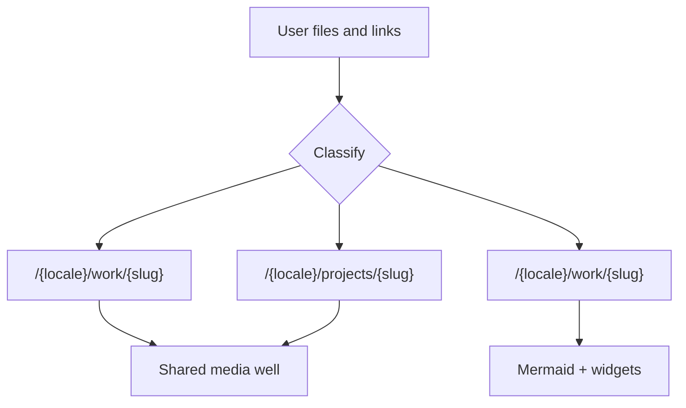

# Content fulfillment playbook

Canonical instructions for putting work on this site. When the user drops links, PDFs, screenshots, or notes and asks to publish them, follow this file.

Do **not** put custom agent rules in `AGENTS.md` — Next.js regenerates that file.

## When this applies

The user provides source material (files, URLs, short notes) and wants it on the site. Classify the drop, extract a summary, save media in the Obsidian vault, write English first, then Belarusian, and let the site loader pick it up. If a needed page type or media component does not exist yet, **build it in the same change**.

## Classify

Prefer the type the user named. Otherwise:

| Signal | Type |
| --- | --- |
| Client / job / commissioned visual work, PDF decks, Dribbble shots, motion reels | **Portfolio** |
| Deep process, constraints, outcomes, “how we got there” | **Case study** |
| Personal / side product, existing pet-project slug | **Pet project** |

Home is five blocks: Hero, Experience, Portfolio, Case studies, Pet projects. Pet projects stay preview-gated.



## Vault

Open **[`content/vault/`](content/vault/)** in Obsidian (not the whole repo). That folder is the source of truth. Next.js reads it at build time via [`lib/vault/load.ts`](lib/vault/load.ts). Do **not** put page copy back into TypeScript catalogs.

```text
content/vault/
  experience/{id}.en.md
  work/{slug}/{slug}.en.md      # note + images
  case-studies/{slug}.en.md
  projects/{slug}/{slug}.en.md  # note + logo + gallery/media
```

- **English is canonical.** Write `{slug}.en.md` first. Set `needs_translation: true` until `{slug}.by.md` exists and is real Belarusian.
- **Agents** tighten EN, fill YAML, then create/update the sibling `.by.md`. Do not invent `by` in the same pass as a rough EN dump unless the user asked to publish immediately.
- Both locales **share image files**. Never duplicate PNGs per language.
- Obsidian settings in [`content/vault/.obsidian/app.json`](content/vault/.obsidian/app.json): markdown links, relative attachments in the note folder. `![[file]]` still works; the loader rewrites it.
- `[[slug]]` wikilinks resolve to work or project routes. Do not leave `[[brackets]]` in rendered copy.
- UI chrome stays in [`messages/en.json`](messages/en.json) / [`messages/by.json`](messages/by.json). Skills stay in [`content/skills.ts`](content/skills.ts).

Slugs: lowercase kebab-case, ASCII, stable. Reuse an existing pet-project slug when filling one in. Preserve grid/timeline order with `order`.

## Global rules

- **Locales:** every user-facing string is `en` and `by`. Match existing vault voice: product-first, concise, no filler, no marketing superlatives.
- **Summarize.** Do not dump source text onto the page. Keep original article URLs as citations / further reading.
- **Media lives in the vault note folder.** Download images next to the note. The site serves them at `/media/...`. Do not hotlink Dribbble, OG images, or CDNs. YouTube is the only embed exception (privacy-enhanced iframe). Do not put editorial media in `public/` (CV PDF and hero stills stay there).
- **NDA:** if `stage === "nda"` (or the user says it is confidential), no public detail route, no extracted media, no quotes from the source, no public widgets. Grid card stays private (ASCII noise pattern).
- **Pet projects** stay preview-only until [`lib/site-url.ts`](lib/site-url.ts) changes. Do not leak them onto production.
- **Visual language:** `max-w-5xl`, `rounded-2xl`, `border-border`, Geist, `text-muted` / `text-foreground`. Prefer scroll-snap over a carousel library.
- **Missing UI:** implement the primitive in the same PR. Do not leave “TODO: add carousel later.”

## File map

| Path | Role |
| --- | --- |
| [`content/vault/experience/`](content/vault/experience/) | Career timeline notes |
| [`content/vault/work/`](content/vault/work/) | Portfolio shots + page images |
| [`content/vault/case-studies/`](content/vault/case-studies/) | Long-form case studies |
| [`content/vault/projects/`](content/vault/projects/) | Pet projects + logos + galleries |
| [`content/skills.ts`](content/skills.ts) | Hero skill trail |
| [`messages/en.json`](messages/en.json), [`messages/by.json`](messages/by.json) | Nav, headings, CTAs |
| [`public/cv/`](public/cv/) | CV PDF |
| [`app/[locale]/work/[slug]/page.tsx`](app/[locale]/work/[slug]/page.tsx) | Shared portfolio + case-study detail |
| [`app/[locale]/projects/[slug]/page.tsx`](app/[locale]/projects/[slug]/page.tsx) | Pet-project detail |
| [`app/media/[...path]/route.ts`](app/media/[...path]/route.ts) | Vault binary serving |

## Shared media well

Portfolio and pet-project media share one outer frame:

- Width: content column (`max-w-5xl` on the page, full width of the article)
- Chrome: `rounded-2xl border border-border overflow-hidden`
- **YouTube:** iframe fills the well at **16:9**
- **Local video:** `<video>` in the same well; height follows the file aspect ratio
- **PDF carousel:** same well; height follows the page aspect ratio
- Components: `MediaFrame`, `MediaCarousel` (scroll-snap), `YouTubeEmbed`, `VideoEmbed`

Relative paths in YAML (`cover: page-01.jpg`, `src: gallery/import.jpg`) are rewritten to `/media/work/{slug}/...`.

---

## Portfolio

Route: `/{locale}/work/{slug}`. Note: `content/vault/work/{slug}/{slug}.en.md`. Body = caption. Frontmatter holds `title`, `cover`, `pages`, `youtube`, `dribbbleUrl`, `links`.

### PDF

1. Convert pages to PNG in the note folder:
   ```bash
   pdftoppm -png -r 144 source.pdf content/vault/work/{slug}/page
   ```
   Fallback: `pdftocairo -png` or ImageMagick `magick`. Zero-pad names: `page-01.png`, `page-02.jpg`.
2. Put a **carousel preview** of the pages in the media well (scroll-snap, one page per slide, peek/dots or page index).
3. Also put **each extracted PNG on the work page** — carousel plus stills. Set `pages.count` / `width` / `height` (or `files` when names are not `page-NN.jpg`).
4. Do **not** commit the source PDF unless the user wants it as a public download.
5. Write a short bilingual summary in the note body (what it is, for whom, what you made). Do not transcribe slides.

### YouTube

1. Parse the video id from `watch?v=`, `youtu.be/`, `/embed/`, or `/shorts/`.
2. YAML:
   ```yaml
   youtube:
     id: WB-v16caDZQ
     title: UI test
     caption: Shop UI motion — grid, 3D preview, controller prompts.
   ```
3. Embed uses `https://www.youtube-nocookie.com/embed/{id}` at 16:9. Cover image lives in the note folder.

### Local video (mp4 / webm)

1. Save next to the note. Do not hotlink CDNs.
2. Keep the file small: `+faststart`, H.264, extract a poster JPEG for `preload="none"`.
3. Play it with `VideoEmbed` inside `MediaFrame`.

### Dribbble

1. Fetch the shot page. Prefer `og:image`. Save the image in the note folder.
2. Write **1–3 sentences** in the EN body, then BY. Caption, not a case study.
3. `dribbbleUrl` plus optional `links`.

---

## Case studies

Route: `/{locale}/work/{slug}`. Note body **is** the article (`## Context`, `## Effort`, process, outcome). Frontmatter: `slug`, `experienceId`, `title`, `summary`, `stack`, `related`.

Required sections in the markdown body:

| Block | What to write |
| --- | --- |
| Context / problem | Who, what constraint, why it mattered |
| **Effort** | Duration, role, team (or solo), constraints, what was hard |
| Process | Iterations and decisions — not a tool list |
| Outcome | What shipped, what changed |
| Diagram | At least one Mermaid fence |

### Mermaid

Edit in Obsidian (` ```mermaid ` fences). The site renders them with [`MermaidDiagram`](components/MermaidDiagram.tsx).

- Prefer flowchart / sequence / timeline.
- Node IDs: camelCase, no spaces; quote labels that contain punctuation.
- No extra colors — the renderer uses site dark tokens.

### Widgets

Interactive demos use a `widget` fence, not JSX/MDX:

````md
```widget
id: thumbnail-pipeline
```
````

Register the React component in [`components/widgets/registry.ts`](components/widgets/registry.ts). Unknown ids render a placeholder. First real widget is a first-use primitive: component + register + fence in the same PR. Vault stores only `id` + props. NDA studies must not embed public widgets that leak the work.

Do not turn a Dribbble shot or a one-pager into a case study unless the user asked for that depth.

---

## Pet projects

Grid + detail: vault notes, [`app/[locale]/projects/[slug]/page.tsx`](app/[locale]/projects/[slug]/page.tsx), [`components/ProjectLogo.tsx`](components/ProjectLogo.tsx).

When the user gives a **link** (site, App Store, GitHub, YouTube, Telegram, itch, article):

1. Fetch the page. Extract title, description, hero / `og:image`, extra article links.
2. Save images in `content/vault/projects/{slug}/`. Raster logos as `logo.png`.
3. Rewrite the bilingual `description` in frontmatter — a tight summary, not the OG dump.
4. Set `url` to the primary destination. Extra `links` for articles, repos, stores.
5. If the logo is missing, add `logo.png` or an inline SVG mark in `ProjectLogo`.
6. YouTube / local video / PDF / Dribbble uses the same media-well YAML as Portfolio (`media:`).

### Gallery (Blood Labs pattern)

Phone-screenshot strips stay a **YAML gallery**, not a pile of body images — that keeps the horizontal snap strip:

```yaml
gallery:
  - src: gallery/import.jpg
    alt: Blood Labs import screen — add lab results from a photo or PDF
```

Put files in `gallery/` next to the note. Alts are per locale (EN vs BY files). Width/height are probed from the file.

NDA pet projects stay non-routable. Do not extract public media for them.

---

## Experience

Notes in `content/vault/experience/{id}.en.md`. Frontmatter: `id`, `start`, `end`, `company`, `role`. Body = markdown bullets (the timeline list).

---

## First-use primitives

Create only when the first content item needs them. Name and role:

| Primitive | Role |
| --- | --- |
| `MediaFrame` | Shared bordered well |
| `MediaCarousel` | Scroll-snap page/image preview |
| `YouTubeEmbed` | 16:9 nocookie iframe inside `MediaFrame` |
| `VideoEmbed` | Self-hosted `<video>` inside `MediaFrame` |
| `MermaidDiagram` | Client renderer for ` ```mermaid ` fences |
| Widget registry | `components/widgets/` + ` ```widget ` fence |
| Work / case-study routes | `generateStaticParams`, locale, `notFound` |
| Home sections + nav | Grid + `/{locale}#section` links, i18n in both message files |

Match [`ProjectsGrid`](components/ProjectsGrid.tsx) and the pet-project detail page: fade-up, pills for metadata, muted body copy, pill CTA for outbound links.

## Voice and copy

- One or two short paragraphs beat a wall of text.
- Name the artifact (what shipped), not the software used, unless the stack is the story.
- Belarusian should be real `by` copy, not a machine-calqued mirror when existing entries already use natural phrasing.
- Title splitting for headings: keep meaningful phrases together, balance line lengths, max 3 lines, do not strand “A” / “The” / “Of”.

## Fulfillment checklist

1. Classify (Portfolio / Case study / Pet project) and pick or reuse a slug.
2. Write the English vault note; extract and summarize; keep citation links.
3. Save images in the note folder (gallery files under `gallery/`). Convert PDF pages to PNG there.
4. Agent-improve EN, then write `{slug}.by.md`. Fill effort + Mermaid for case studies.
5. Implement any missing media/route/nav/widget primitive in this change.
6. Confirm the loader picks it up (home grid + detail). Add a logo for pet projects.
7. Honor NDA and preview-only pet projects. Do not commit secrets or confidential PDFs.
8. Scan the page against existing spacing, type, and chrome before finishing.
