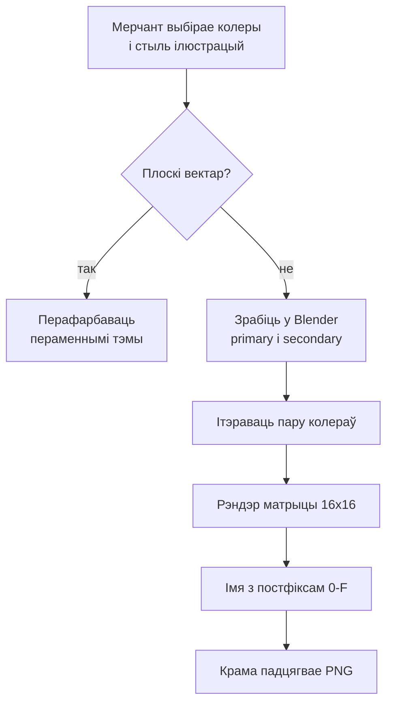
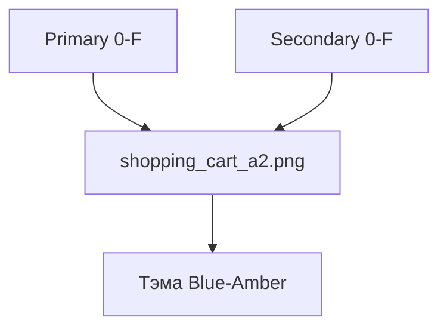

## Кантекст

Прадукт быў канструктарам тэм для крам Shopify. Кліентам было мала двух колераў брэнда — патрэбны былі ілюстрацыі, што належаць краме, у выбраным стылі.

Плоскі вектар перафарбоўваецца за адзін праход пераменнымі тэмы. Сапраўднае абмежаванне — 3D: рэндэр — гэта ўжо гатовая выява. Primary і secondary мусяць быць у сцэне, потым кожную пару трэба адрэндэрыць, назваць і аддаць.
## Намаганні

**Працягласць.** Некалькі месяцаў

**Роля.** UI & Visual Designer

**Каманда.** Аднаасобна

### Абмежаванні

- Колеры тэмы — пара primary–secondary
- Вектары перафарбоўваюцца пераменнымі; 3D-рэндэры — не
- 16 адценняў × 16 адценняў = 256 рэндэраў на ілюстрацыю

### Што было складана

- Ілюстрацыя, якая чытаецца пасля змены абодвух колераў
- Ітэраваць пару ў Blender, потым рэндэрыць усю матрыцу
- Пошук на вітрыне без базы імёнаў файлаў

*Ад выбару палітры да патрэбнага PNG.*

## Працэс

### Два тыпы арта

Мерчанты выбіралі стыль ілюстрацый разам з колерамі. Плоскі вектар ідзе за тэмай за адзін крок: змяніць пераменныя. 3D — не. Рэндэр — пікселі; пара мусіць быць у файле.

### Дызайн у Blender

Ілюстрацыі збіраліся з primary і secondary як матэрыяламі. Ітэраваць пару ў сцэне, пакуль абодва колеры чытаюцца — потым batch. Пасля рэндэра перафарбоўкі няма.

### Матрыца 16×16

Уласны плагін рэндэрыў кожную пару. Шэсцьнаццаць адценняў на кожнай восі: 256 файлаў на ілюстрацыю. Гэта цана 3D, якое ўсё роўна супадае з тэмай.

### Hex-постфікс

Колеры пазначаны 0–F. Пара — суфікс імя файла. shopping_cart_a2.png — тэма Blue–Amber. Крама складае імя з палітры, якая ўжо ёсць; табліцы пошуку няма.

*Пара — імя файла: shopping_cart_a2.png — Blue–Amber.*

## Рашэнне

Папярэдне адрэндэраная матрыца плюс пошук па постфіксе. Крама падцягвае PNG. Runtime-перафарбоўкі на 3D няма.

## Вынік

- 256 каляровых варыянтаў на 3D-ілюстрацыю без ручнога экспарту
- Вітрына знаходзіць файл па постфіксе, не па табліцы
- 3D-арт супадае з палітрай, якую мерчант ужо задаў
