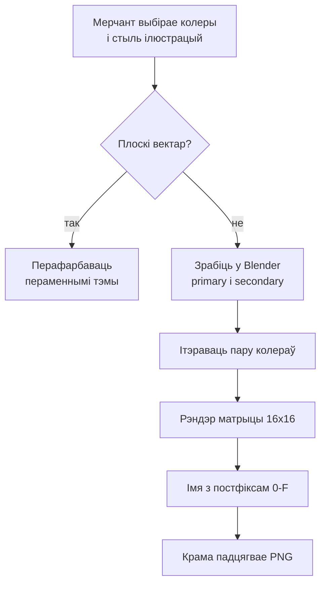
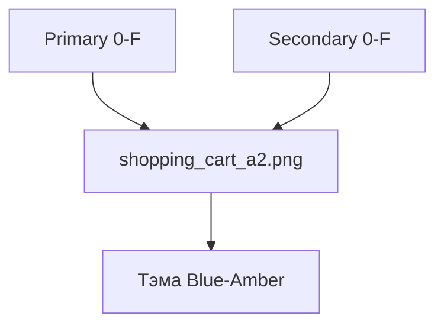

## Кантекст

Канструктар тэм Shopify дазваляў мерчантам задаваць primary і secondary колеры і выбіраць стыль ілюстрацый. Візуальная сістэма павінна была зрабіць гэтыя выбары часткай дызайну, а не проста затаніраваць выпадковы асет.

Вектары маглі рэагаваць на пераменныя тэмы. 3D — не: пасля рэндэра колер становіцца пікселямі. Кожная пара primary–secondary мусіла быць у асеце, мець прадказальнае імя і аддавацца вітрыне без асобнай табліцы пошуку.

Я спраектаваў 3D-шлях як задачу даных: абмежаваць палітру, адрэндэрыць яе адзін раз і дазволіць вітрыне самой скласці імя файла.
## Намаганні

**Працягласць.** Некалькі месяцаў

**Роля.** UI & Visual Designer

**Каманда.** Аднаасобна

### Абмежаванні

- Колеры тэмы — пара primary–secondary
- Вектары перафарбоўваюцца пераменнымі; 3D-рэндэры — не
- 16 адценняў × 16 адценняў = 256 рэндэраў на ілюстрацыю

### Што патрабавала рашэнняў

- Ілюстрацыя павінна была захоўваць чытэльнасць пасля дзвюх незалежных зменаў колеру
- 3D патрабаваў поўнай матрыцы замест перафарбоўкі ў рэальным часе
- Вітрыне патрэбны быў прадказальны пошук без базы імёнаў файлаў

*Ад выбару палітры да патрэбнага PNG.*

## Працэс

### Два шляхі рэндэра

Мерчанты выбіралі стыль ілюстрацый разам з колерамі. Плоскі вектар ішоў за тэмай за адзін крок — праз замену пераменных. Для 3D пару колераў трэба было закласці ў сцэну да рэндэра.

### Закласці колеры ў 3D-сцэну

Я збіраў ілюстрацыі ў Blender з primary і secondary як матэрыяламі. Ітэраваў пару ў сцэне, пакуль абодва колеры чыталіся, потым запускаў batch. Пасля рэндэра надзейнай перафарбоўкі ўжо не было.

### Адрэндэрыць матрыцу 16×16

Уласны плагін рэндэрыў кожную пару: шаснаццаць адценняў на кожнай восі, 256 файлаў на ілюстрацыю. Матрыца рабіла 3D прадказальным і захоўвала сувязь з тэмай мерчанта.

### Знаходзіць па імені файла

Кожнаму адценню прызначаўся hex-індэкс ад 0 да F. Пара станавілася суфіксам імя файла: `shopping_cart_a2.png` азначала тэму Blue–Amber. Вітрына ўжо ведала выбраную палітру, таму магла скласці імя непасрэдна — без табліцы пошуку.

*Пара — імя файла: shopping_cart_a2.png — Blue–Amber.*

## Вынік

У выніку мы атрымалі папярэдне адрэндэраваны набор 3D-ілюстрацый і прадказальны кантракт імя файла. Вітрына запытвала патрэбны PNG; перафарбоўка 3D у рэальным часе не патрабавалася.

- 256 каляровых варыянтаў на 3D-ілюстрацыю без ручнога экспарту кожнай пары
- Адзін кантракт імя файла замяніў асобную табліцу пошуку
- Колеры, выбраныя мерчантам, пераходзілі ў 3D-ілюстрацыю
