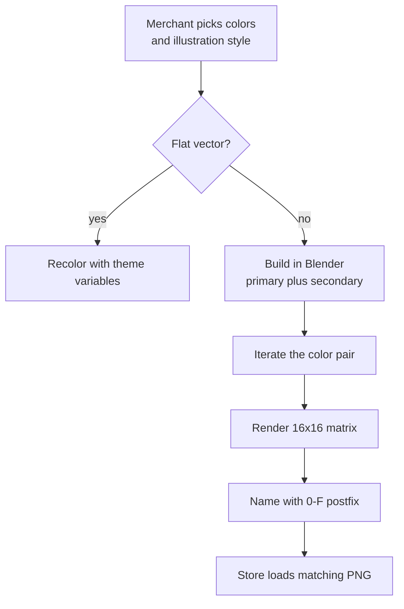
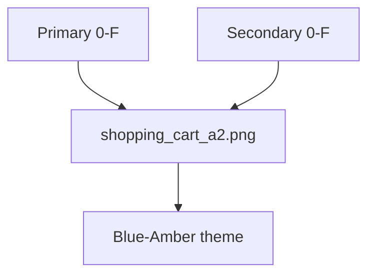

## Context

The Shopify theme builder let merchants choose a primary and secondary color, then pick an illustration style. The visual system needed those choices to feel intentional, not like a generic asset with a tint applied.

Vectors could respond to theme variables. 3D could not: once rendered, color was pixels. Each primary–secondary pair had to be present in the asset, named predictably, and returned to the storefront without a lookup table.

I designed the 3D path as a data problem: constrain the palette, render it once, and let the storefront derive the file name.
## Effort

**Duration.** Multi-month

**Role.** UI & Visual Designer

**Team.** Solo

### Constraints

- Theme colors are a primary–secondary pair
- Vectors recolor with variables; 3D renders cannot
- 16 hues × 16 hues = 256 renders per illustration

### What required judgment

- Illustration had to stay legible after two independent color changes
- 3D needed a complete matrix instead of runtime recoloring
- The storefront needed a predictable lookup without a filename database

*From palette pick to the matching PNG.*

## Process

### Two rendering paths

Merchants selected an illustration style alongside the colors. Flat vectors followed the theme in one step by swapping variables. For 3D, the color pair had to be built into the scene before rendering.

### Build color into the 3D scene

I built the illustrations in Blender with primary and secondary as materials. I iterated on the pair in-scene until both colors still read, then rendered the batch. There was no reliable recolor step after the render.

### Render the 16×16 matrix

A custom plugin rendered every pair: sixteen hues on each axis, 256 files per illustration. The matrix made 3D predictable while keeping it tied to the merchant's theme.

### Resolve by filename

Each hue was assigned a hexadecimal index from 0–F. The pair became the filename suffix: `shopping_cart_a2.png` represented the Blue–Amber theme. The storefront already knew the selected palette, so it could build the filename directly — no lookup table.

*The pair is the filename: shopping_cart_a2.png is Blue–Amber.*

## Outcome

The shipped pattern was a pre-rendered 3D library plus a deterministic filename contract. The storefront requested the file it needed; it never had to recolor a 3D image at runtime.

- 256 colorways per 3D illustration without hand-exporting every pair
- One filename contract replaced a separate lookup table
- Merchant-selected colors carried through to the 3D illustration
