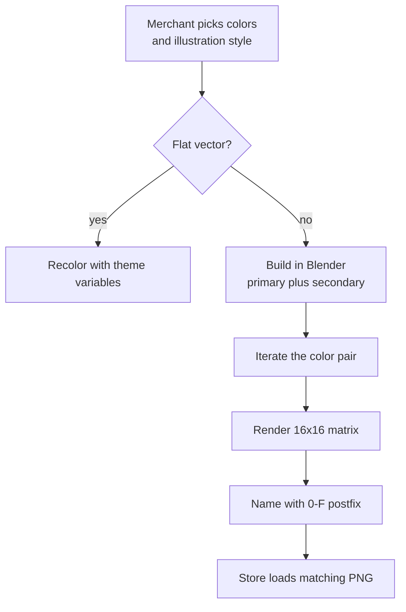
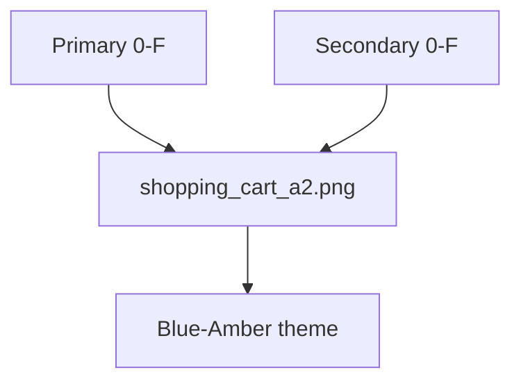

## Context

The product was a theme builder for Shopify stores. Clients wanted more than a two-color setup — they wanted illustrations that belonged to the shop, in a style they chose.

Flat vector art recolors in one pass with theme variables. The real constraint is 3D: a render is a baked image. Primary and secondary have to live in the scene, then every pair has to be rendered, named, and served.
## Effort

**Duration.** Multi-month

**Role.** UI & Visual Designer

**Team.** Solo

### Constraints

- Theme colors are a primary–secondary pair
- Vectors recolor with variables; 3D renders cannot
- 16 hues × 16 hues = 256 renders per illustration

### What was hard

- Art that still reads after both colors swap
- Iterate the pair in Blender, then render the full matrix
- A storefront lookup with no filename database

*From palette pick to the matching PNG.*

## Process

### Two kinds of art

Merchants picked illustration style as well as colors. Flat vectors follow the theme in one step: swap the variables. 3D does not. A render is pixels; the pair has to be in the file.

### Design in Blender

Illustrations were built with primary and secondary as materials. Iterate the pair in-scene until both colors still read — then batch. No recolor after the render.

### 16×16 matrix

A custom plugin rendered every pair. Sixteen hues on each axis: 256 files per illustration. That is the cost of 3D that still matches the theme.

### Hex postfix

Colors marked 0–F. The pair is the filename suffix. shopping_cart_a2.png is the Blue–Amber theme. The store builds the name from the palette it already has; no lookup table.

*The pair is the filename: shopping_cart_a2.png is Blue–Amber.*

## Solution

Pre-rendered matrix plus a postfix lookup. The store loads the PNG. No runtime recolor on the 3D art.

## Impact

- 256 colorways per 3D illustration without hand-export
- Storefront resolve is a postfix, not a table
- 3D art matches the palette the merchant already set
