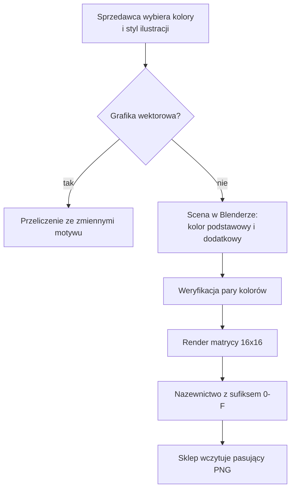
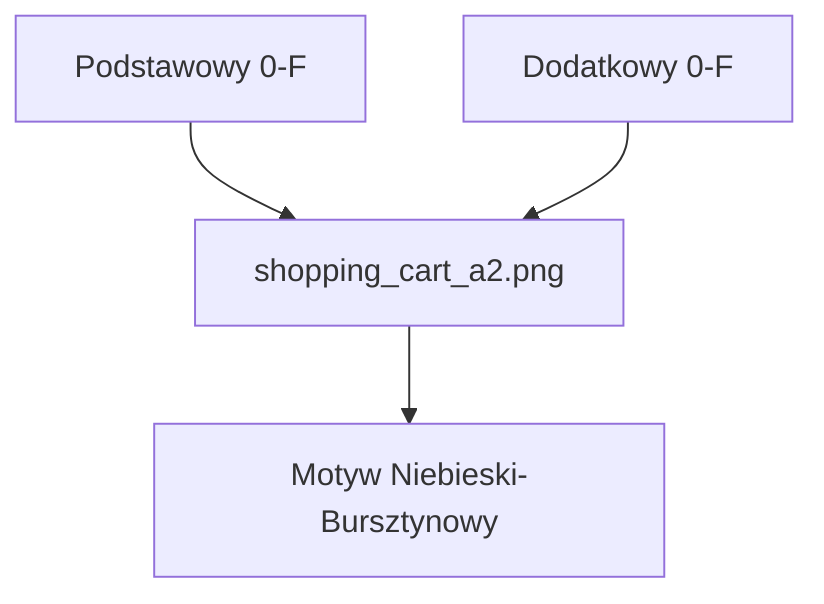

```widget
id: chameleon-colorways
```

## Kontekst

Kreator motywów Shopify pozwalał sprzedawcom wybierać kolor podstawowy i dodatkowy, a następnie styl ilustracji. System wizualny musiał sprawiać, że te wybory wyglądają na zamierzone, a nie jak generyczna grafika z nałożonym przypadkowym filtrem.

Grafiki wektorowe mogły reagować na zmienne motywu w czasie rzeczywistym. Grafika 3D nie miała takiej możliwości: po wyrenderowaniu kolor staje się pikselami. Każda para kolorów podstawowy–dodatkowy musiała znaleźć się w materiale graficznym, posiadać przewidywalną nazwę i trafiać do sklepu bez konieczności odpytywania bazy danych.

Zaprojektowałem ścieżkę 3D jako zagadnienie operowania danymi: zawęzić paletę, wyrenderować ją jednorazowo i pozwolić frontendowi bezpośrednio wyznaczać nazwę pliku.

## Wkład

**Czas trwania.** Kilka miesięcy

**Rola.** UI & Visual Designer

**Zespół.** Samodzielnie

### Ograniczenia

- Kolory motywu to para podstawowy–dodatkowy
- Wektory zmieniają kolory dzięki zmiennym CSS/SVG; rendery 3D nie
- 16 odcieni × 16 odcieni = 256 renderów na każdą ilustrację

### Co wymagało decyzji projektowej

- Ilustracje musiały zachować czytelność po dwóch niezależnych zmianach kolorów
- 3D wymagało pełnej matrycy wariantów zamiast przeliczania w czasie rzeczywistym
- Sklep potrzebował przewidywalnego schematu odwołań bez dodatkowej tabeli mapowania nazw plików

*Od wyboru palety do pasującego pliku PNG.*



## Proces

### Dwie ścieżki renderowania

Sprzedawcy wybierali styl ilustracji równolegle z kolorami. Płaskie wektory dostosowywały się do motywu w jednym kroku poprzez podmianę zmiennych. W przypadku 3D para kolorów musiała zostać wprowadzona do sceny jeszcze przed etapem renderowania.

### Wprowadzenie kolorów do sceny 3D

Przygotowałem ilustracje w Blenderze, definiując kolor podstawowy i dodatkowy jako osobne materiały. Testowałem ich relacje bezpośrednio w scenie, dopóki oba kolory pozostawały czytelne, a następnie uruchamiałem renderowanie wsadowe. Nie istniała niezawodna metoda rekoloryzacji po zakończeniu renderu.

### Renderowanie matrycy 16×16

Dedykowany skrypt renderował każdą możliwą parę: szesnaście odcieni na każdej osi, dając 256 plików na każdą ilustrację. Matryca zapewniła przewidywalność grafiki 3D, zachowując jej ścisły związek z motywem sklepu.

### Rozpoznawanie na podstawie nazwy pliku

Każdemu odcieniowi przypisano indeks szesnastkowy od 0 do F. Para indeksów stała się sufiksem nazwy pliku: `shopping_cart_a2.png` odpowiadał motywowi Niebieski–Bursztynowy. Ponieważ sklep znał już wybraną paletę, generował docelową nazwę pliku bezpośrednio — bez konieczności odpytywania zewnętrznych tabel.

*Para tworzy nazwę pliku: shopping_cart_a2.png to wariant Niebieski–Bursztynowy.*



## Rezultaty

Wdrożonym wzorcem była biblioteka wyrenderowanych wcześniej zasobów 3D połączona z deterministycznym schematem nazewnictwa. Sklep bezpośrednio pobierał potrzebny plik, unikając kosztownego przetwarzania grafiki w czasie rzeczywistym.

- 256 wariantów kolorystycznych na ilustrację 3D bez konieczności ręcznego eksportu każdej pary
- Deterministyczny kontrakt nazewnictwa zastąpił osobną bazę mapowania
- Wybrane przez sprzedawcę kolory zostały spójnie przeniesione do ilustracji 3D
