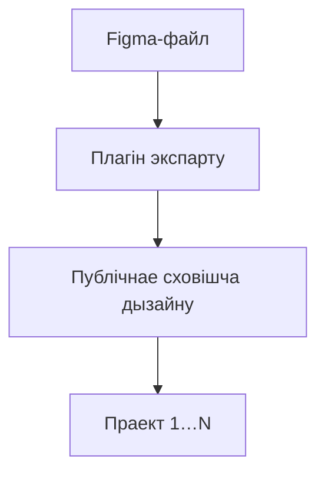
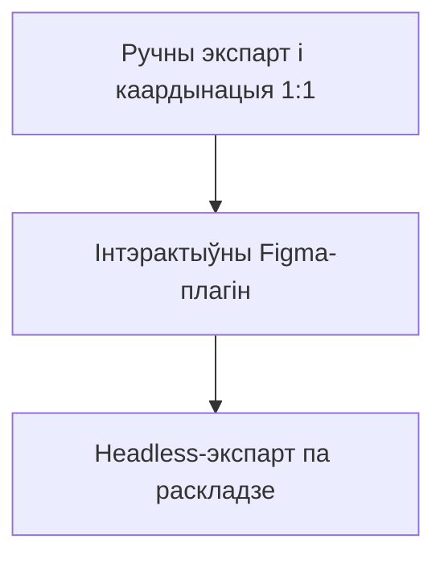

```widget
id: design-system-graph
```

## Кантекст

Платформа была складаным B2B-прадуктам. Адна толькі UX і Design System не падавалася — патрэбна была яшчэ **Graphic Design System**. Кожны кліент хацеў прыладваць платформу пад свой брэнд: унікальныя спалучэнні колераў, тыпографіі, іконак, ілюстрацый і іншых візуальных актываў.

Некалькі асобных праектаў маглі быць звязаныя і дзяліць адну бібліятэку. Маркетынгу таксама патрэбныя былі гэтыя актывы для прома-матэрыялаў. З ростам сістэмы галоўным стала архітэктурнае пытанне: **як прадугаджаць змены, падтрымліваць розныя сцэнарыі і захоўваць кансістэнтнасць?**

Figma — хмарная супольная срэда, а не Git. Адсочваць і сінхранізаваць змены актываў паміж праектамі было цяжка — асабліва калі вялікія каманды мелі свае ўяўленні пра экспарт, іменаванне і захоўванне.

## Намаганні

**Роля.** Lead Graphic Design, Design Engineer

**Каманда.** Аднаасобна на плагіне і пайплайне

### Абмежаванні

- Брэнд-камбінацыі пад кліента на адной агульнай бібліятэцы
- Некалькі звязаных праектаў, якія спажываюць тыя ж экспарты
- Перадача кожнага актыва ў фармаце 1:1 паміж дызайнерам і распрацоўнікам
- Няма кантролю версій для Figma-файлаў так, як у кодавых рэпазіторыях

### Што было цяжка

- Прадказальны workflow, зразумелы і дызайнерам, і распрацоўнікам
- Правілы экспарту па старонках без ручнай перапіскі
- Маштабаванне ад інтэрактыўнага плагіна да запланаваных headless-абнаўленняў


*Укладка Export: экспарт па актывах. Налады: маскі папак і файлаў, фарматы і мапінг стыляў.*



## Працэс

### Спачатку workflow

Маштабавальная Graphic Design System патрабуе надзейнага, прадказальнага workflow — актывы арганізаваныя так, каб і дызайнерам, і распрацоўнікам было зразумела. Гэта была адна частка задачы.

### Плагін Figma Export

Другая — дастаўка актываў. Я зрабіў **плагін Figma Export**, які сканіруе ўсе старонкі ў файле. Кожная старонка можа мець свае правілы экспарту: куды ідуць актывы, як яны экспартуюцца і як называюцца. Дызайнеры экспартуюць увесь файл або толькі абраныя старонкі.

Гэта ператварыла працэс з шматлікіх перамоваў у просты пайплайн: **Figma → Export → Public Design Storage → Праект 1…N**.

### Headless-аўтаматызацыя

Пасля праверкі workflow я зрабіў **headless-версію плагіна**. Экспарт можна было запускаць без адкрыцця Figma дызайнерам, а абнаўленні актываў — ставіць па раскладзе.



## Вынік

Сістэма перайшла ад ручнага, камунікацыйна цяжкага працэсу да **аўтаматызаванага design-to-production пайплайну**. Меньш каардынацыі паміж дызайнерамі і распрацоўнікамі; актывы застаюцца сінхранізаванымі ў звязаных праектах.
