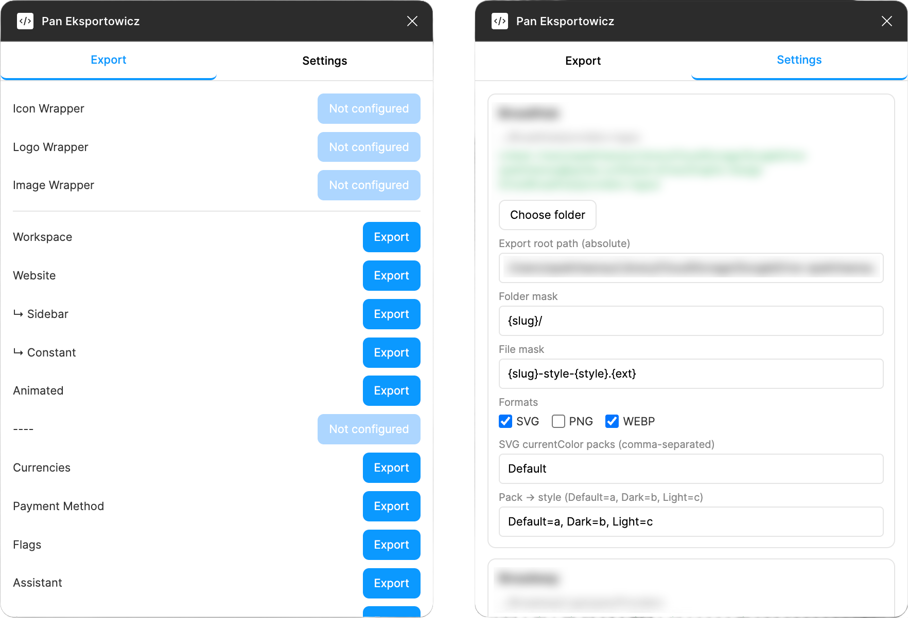
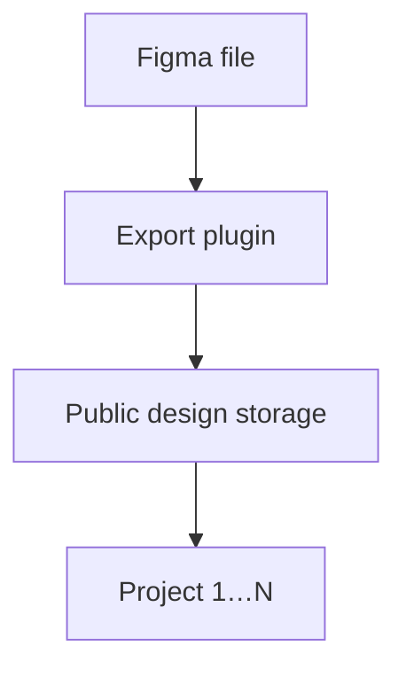
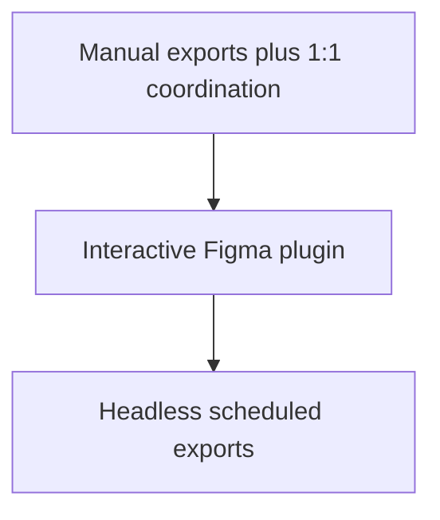

```widget
id: design-system-graph
```

## Context

The platform was a complex B2B product. A solid UX and Design System were not enough — it also needed a **Graphic Design System**. Every customer wanted to adapt the platform to their own brand: unique combinations of colors, typography, icons, illustrations, and other visual assets.

Multiple standalone projects could be connected and share the same library. Marketing teams needed those assets for promotional materials too. As the system grew, the challenge became architectural: **how do you anticipate change, support multiple use cases, and keep everything consistent?**

Figma is collaborative and cloud-based, not Git-like. Tracking and synchronizing asset changes across projects was difficult — especially when large teams each had their own preferences for export tools, naming, and storage.

## Effort

**Role.** Lead Graphic Design, Design Engineer

**Team.** Solo on the plugin and pipeline

### Constraints

- Per-customer brand combinations on one shared asset library
- Multiple connected projects consuming the same exports
- Designer–developer 1:1 coordination for every asset drop
- No version control for Figma files the way code repos work

### What was hard

- A predictable workflow that both designers and developers could follow
- Per-page export rules without manual back-and-forth
- Scaling from an interactive plugin to scheduled, headless updates



*Export tab: per-asset export triggers. Settings: folder/file masks, formats, and style mapping.*



## Process

### Workflow first

A scalable Graphic Design System needs a robust, predictable workflow — assets organized in a way that is intuitive for both designers and developers. That was one side of the problem.

### Figma Export plugin

The other was asset delivery. I built a **Figma Export plugin** that scans all pages in a file. Each page can have its own export rules: where assets go, how they are exported, and how they are named. Designers export the entire file or only selected pages.

This turned a communication-heavy process into a simple pipeline: **Figma → Export → Public Design Storage → Project 1…N**.

### Headless automation

After validating the workflow, I built a **headless version of the plugin**. Exports could run without a designer opening Figma, and asset updates could be scheduled automatically.



## Outcome

The system evolved from a manual, communication-heavy process into an **automated design-to-production pipeline**. Less coordination between designers and developers; assets stay synchronized across connected projects.
