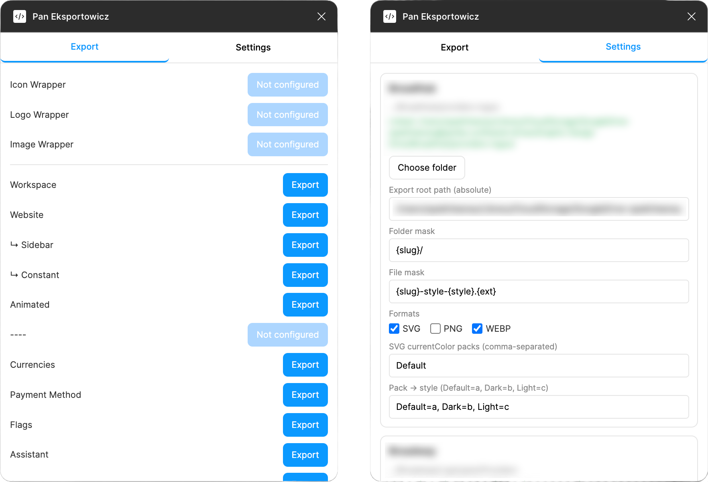
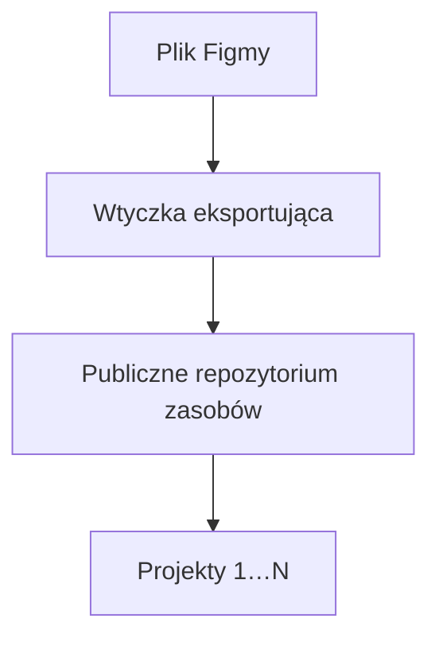
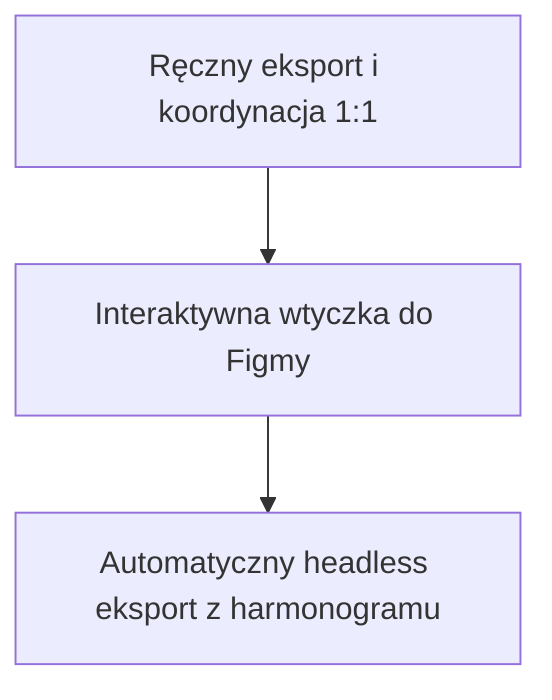

```widget
id: design-system-graph
```

## Kontekst

Platforma była złożonym produktem B2B. Solidny UX i Design System nie wystarczały — konieczny był **Graficzny System Projektowania** (Graphic Design System). Każdy klient chciał dostosować platformę do własnego brandingu: unikalnych kombinacji kolorów, typografii, ikon, ilustracji i innych elementów wizualnych.

Wiele niezależnych projektów musiało korzystać z tej samej biblioteki zasobów. Działy marketingu również potrzebowały tych grafik do materiałów promocyjnych. Wraz z rozwojem systemu wyzwanie stało się architektoniczne: **jak przewidzieć zmiany, obsłużyć zróżnicowane scenariusze użycia i utrzymać pełną spójność?**

Figma działa w chmurze i opiera się na współpracy w czasie rzeczywistym, nie posiadając natywnego wersjonowania w stylu Gita. Śledzenie i synchronizacja zmian w grafikach między projektami były trudne — szczególnie gdy duże zespoły stosowały własne narzędzia eksportu, nazewnictwo i strukturę katalogów.

## Wkład

**Rola.** Lead Graphic Design, Design Engineer

**Zespół.** Samodzielnie (wtyczka i potok eksportu)

### Ograniczenia

- Indywidualne zestawy brandingu klientów oparte na jednej bibliotece zasobów
- Wiele połączonych projektów korzystających z tych samych wyeksportowanych plików
- Konieczność bieżącej koordynacji 1:1 między projektantami a programistami przy każdej zmianie
- Brak tradycyjnej kontroli wersji dla plików Figmy

### Co było trudne

- Zaprojektowanie przewidywalnego przepływu pracy, zrozumiałego zarówno dla projektantów, jak i inżynierów
- Reguły eksportu per strona bez konieczności ciągłych ustaleń
- Przejście od interaktywnej wtyczki do w pełni zautomatyzowanych, bezgłowych (headless) aktualizacji



*Zakładka Export: wyzwalacze eksportu per zasób. Ustawienia: maski folderów i plików, formaty oraz mapowanie stylów.*



## Proces

### Najpierw przepływ pracy

Skalowalny Graficzny System Projektowania wymaga stabilnego i przewidywalnego potoku pracy — zasobów zorganizowanych w sposób intuicyjny zarówno dla twórców grafiki, jak i programistów. To stanowiło pierwszą część zadania.

### Wtyczka eksportująca do Figmy

Drugim elementem było dostarczanie zasobów. Zbudowałem **wtyczkę eksportującą do Figmy**, która analizuje wszystkie strony w pliku. Każda strona może posiadać własne reguły: docelową lokalizację, formaty oraz wzorzec nazewnictwa. Projektanci mogą eksportować cały plik lub wyłącznie wybrane strony.

Zmieniło to proces wymagający ciągłych ustaleń w prosty potok: **Figma → Eksport → Publiczne repozytorium zasobów → Projekty 1…N**.

### Automatyzacja headless

Po zweryfikowaniu przepływu pracy przygotowałem **wersję headless wtyczki**. Eksporty mogły być uruchamiane bez konieczności otwierania Figmy przez projektanta, a aktualizacje zasobów zaplanowano w harmonogramie.



## Rezultaty

System przekształcił się z manualnego, wymagającego ciągłej komunikacji procesu w **zautomatyzowany potok od projektu do środowiska produkcyjnego**. Ograniczono czas koordynacji między projektantami a programistami, zapewniając spójność zasobów we wszystkich połączonych projektach.
