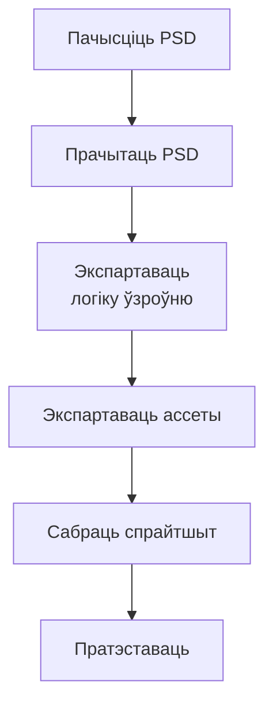

## Кантекст

Пачатак 2010-х, рынак мабільных гульняў рос. Хуткі шлях для студыі — партаваць PC-тытулы на iOS: арт ужо быў, але механіку трэба было перапісаць з кліку мышшу на дотык пальцам. Гэта было да таго, як Unity і Unreal сталі стандартам. Студыя выпускала гульні на ўласным рухавіку. Выдавец даваў арыгінальны арт як PSD — казуальныя гульні, пераважна hidden object, з міні-гульнямі і катсцэнамі. У тых файлах — сотні слаёў з хаатычнымі імёнамі.

Першы парт заняў шэсць месяцаў. Кожны аб'ект экспартаваўся ўручную, ставіўся ў тэкставым рэдактары і падключаўся да стейт-машыны. PSD — стары фармат, не прызначаны для вонкавага парсінгу. З універсітэта быў толькі C++; гэта быў першы інструмент у прадакшне.
## Намаганні

**Працягласць.** Першы тытул 6 месяцаў; пазней 3–4

**Роля.** Game Designer & QA

**Каманда.** Аднаасобна на пайплайне

### Абмежаванні

- Уласны рухавік, кастомны Lua для ўзроўняў і логікі
- PSD ад выдаўца: сотні слаёў, без канвенцыі імён
- PSD не прызначаны для вонкавага парсінгу
- Механіка дотыку перапісаная з PC

### Што было складана

- Першы прадакшн-код
- Хаатычны арт як даныя ўзроўню
- Сістэма імён, дзе імя несла аб'ект і функцыю
- Укласці вынік парсінгу ў той Lua, на якім ужо жыў рухавік

*Ад пачышчанага PSD да ўзроўню на тэст.*

## Працэс

1. Пачысціць PSD — прыбраць або зліць неінтэрактыўныя слаі; перайменаваць пад сістэму
2. Прачытаць PSD
3. Экспартаваць логіку ўзроўню
4. Экспартаваць ассеты
5. Сабраць спрайтшыт
6. Пратэставаць

### Сістэма імён

Імя слоя = аб'ект + функцыя. Дызайнеры трацілі час на чыстку, а не на ручное размяшчэнне кожнага аб'екта.

### Хопіць для парсінгу

Бібліятэка з GitHub чытала імя слоя, xy і bounding box. Гэта клалася ў Lua-фармат узроўняў студыі.

## Рашэнне

Парсер пісаў Lua-логіку ўзроўню, экспартаваў ассеты і збіраў спрайтшыт.

## Вынік

- Наступныя тытулы: 6 месяцаў → 3–4
- Зэканомлены час пайшоў на QA
- Студыя наняла людзей і падпісала больш кантрактаў з выдаўцом
