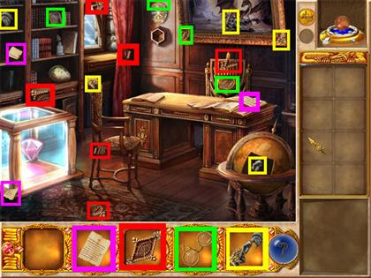
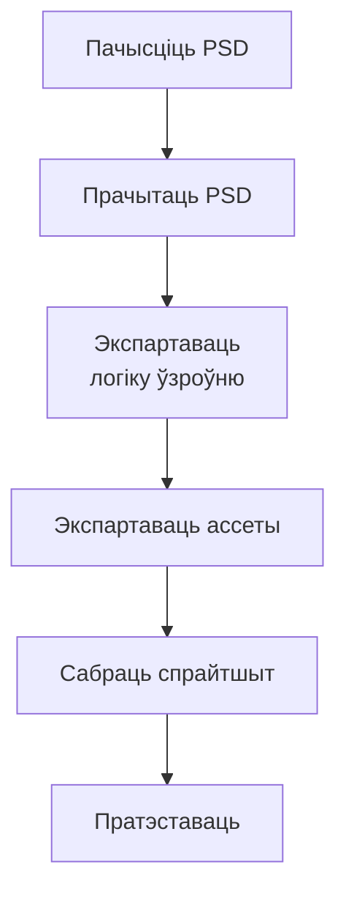

## Кантекст

У пачатку 2010-х у CyberCradle мы пераносілі казуальныя PC-гульні на iOS на ўласным рухавіку. Арт ужо існаваў у Photoshop; узаемадзеянні трэба было перабудаваць пад дотык, а кожны ўзровень ператварыць у Lua-даныя. У PSD ад выдаўца былі сотні слаёў без надзейнай сістэмы імён.

*Magic Encyclopedia: Moon Light. Адна сцэна выдаўца — стос аб'ектаў і інвентар.*

Першы парт заняў шэсць месяцаў. Я ўручную экспартаваў аб'екты, уносіў каардынаты ў тэкставы рэдактар і падключаў іх да стейт-машыны. Паўторная праца стала вузкім месцам — не дызайн гульні. PSD таксама быў старым фарматам без простага вонкавага парсінгу; з праграмавання ў мяне быў універсітэцкі C++, і гэта быў мой першы production-інструмент.
## Намаганні

**Працягласць.** Першы тытул: 6 месяцаў; наступныя: 3–4 месяцы

**Роля.** Game Designer & QA

**Каманда.** Аднаасобна на пайплайне

### Абмежаванні

- Уласны рухавік, кастомны Lua для ўзроўняў і логікі
- PSD ад выдаўца: сотні слаёў, без канвенцыі імён
- PSD не прызначаны для вонкавага парсінгу
- Механіка дотыку перапісаная з PC

### Што патрабавала рашэнняў

- Першы production-код
- Ператварыць візуальныя слаі ў надзейныя даныя ўзроўню
- Сістэма імён, дзе імя несла аб'ект і паводзіны
- Укласці згенераваныя даныя ў той Lua-фармат, на якім ужо жыў рухавік

*Ад пачышчанага PSD да гульнявога ўзроўню на тэст.*

## Працэс

### Зрабіць PSD прадказальным

Я вызначыў невялікую канвенцыю для зыходнага файла: прыбраць або зліць неінтэрактыўныя слаі, а інтэрактыўныя называць як аб'ект плюс функцыю. Чыстка стала ўваходным кантрактам, а не паўторнай ручной падрыхтоўкай да экспарту.

### Прачытаць толькі патрэбныя даныя

Парсер чытаў імя слоя, пазіцыю x/y і bounding box — гэтага было дастаткова, каб перакласці візуальны файл у існы Lua-фармат узроўняў. PSD заставаўся крыніцай для дызайнера, а парсер браў на сябе паўторную перадачу ў рухавік.

### Экспартаваць і тэставаць адным цыклам

Інструмент пісаў Lua-логіку ўзроўню, экспартаваў асеты і збіраў спрайтшыт. Пасля гэтага QA магла адразу тэставаць узровень у рухавіку, а не шукаць праблемы з пазіцыяй пасля доўгага ручнога экспарту.

## Вынік

Інструмент ператвараў пачышчаны PSD у тэставы ўзровень, захоўваючы зыходны файл зручным для дызайнера.

- Наступныя тытулы: 6 месяцаў → 3–4 месяцы
- Вызвалены час пайшоў на QA і гульнявую дапрацоўку
- Паўторны пайплайн падтрымаў рост каманды і дапамог узяць больш кантрактаў з выдаўцом
