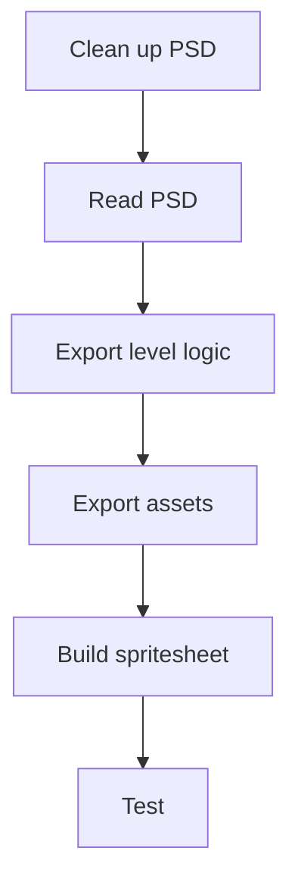

## Context

Early 2010s, mobile games were a growing market. The fast way for a studio to lead was to port PC titles to iOS: art already existed, but mechanics had to be rewritten from cursor click to finger touch. This was before Unity and Unreal were the default. The studio shipped on an in-house engine. A publisher supplied original art as PSD files — casual games, mostly hidden object, with mini-games and cutscenes. Those files held hundreds of layers with chaotic names.

The first port took six months. Every item was exported by hand, placed in a text editor, and wired into a state machine. PSD is an old format, not meant to be parsed from outside. University C++ was the only coding background; this was the first production tooling.
## Effort

**Duration.** First title 6 months; later 3–4

**Role.** Game Designer & QA

**Team.** Solo on the pipeline

### Constraints

- In-house engine, custom Lua for levels and logic
- Publisher PSDs: hundreds of layers, no naming convention
- PSD not designed for external parsing
- Touch mechanics rewritten from PC

### What was hard

- First production code
- Interpreting chaotic art files as level data
- A naming system that encoded object and function
- Fitting parse output to the Lua format the engine already used

*From cleaned PSD to a testable level.*

## Process

1. Clean up PSD — drop or merge non-interactive layers; rename to the system
2. Read PSD
3. Export level logic
4. Export assets
5. Build a spritesheet
6. Test

### A naming system

Layer name = object + function. Designers spent time on cleanup instead of hand-placing every item.

### Enough to parse

A GitHub library could read layer name, xy, and bounding box. That mapped into the studio's Lua level format.

## Solution

The parser wrote Lua level logic, exported assets, and built a spritesheet.

## Impact

- Later titles: 6 months → 3–4
- Saved time went to QA
- Studio hired and signed more publisher contracts
