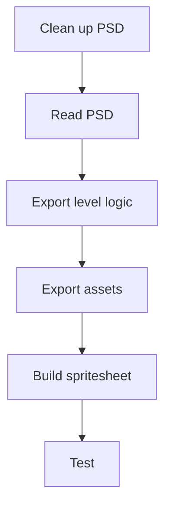

## Context

In the early 2010s, CyberCradle ported casual PC games to iOS on an in-house engine. The art already existed in Photoshop; interaction had to be rebuilt for touch, and each level had to become Lua data. Publisher PSDs contained hundreds of layers with no reliable naming system.

The first port took six months. I exported items by hand, placed coordinates in a text editor, and wired them into a state machine. That repetition made the production handoff — not the game design — the bottleneck. PSD was also an old format with no straightforward external parsing path; I had C++ from university and was building my first production tool.
## Effort

**Duration.** First title: 6 months; later titles: 3–4 months

**Role.** Game Designer & QA

**Team.** Solo on the pipeline

### Constraints

- In-house engine, custom Lua for levels and logic
- Publisher PSDs: hundreds of layers, no naming convention
- PSD not designed for external parsing
- Touch mechanics rewritten from PC

### What required judgment

- First production code
- Turning visual layers into reliable level data
- A naming contract that encoded object and behavior
- Fitting generated data to the Lua format the engine already used

*From cleaned PSD to a playable, testable level.*

## Process

### Make the PSD predictable

I defined a small naming contract for the source file: remove or merge non-interactive layers, then name interactive layers as object plus function. Cleanup became the input contract instead of a recurring export task.

### Parse only the data the engine needed

A parser read the layer name, x/y position, and bounding box — enough to map the visual file into the engine's existing Lua level format. The PSD remained the designer-facing source; the parser carried the repetitive handoff.

### Export and test as one loop

The tool wrote Lua level logic, exported the art, and built a spritesheet. QA could then test the level in the engine instead of discovering placement problems after a long manual export.

## Outcome

The tool turned a cleaned PSD into a testable level while keeping the designer's source file intact.

- Later titles dropped from 6 months to 3–4 months
- Recovered production time went to QA and gameplay polish
- A repeatable pipeline supported the studio as it hired and took on more publisher contracts
