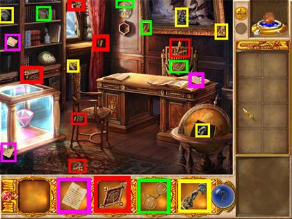
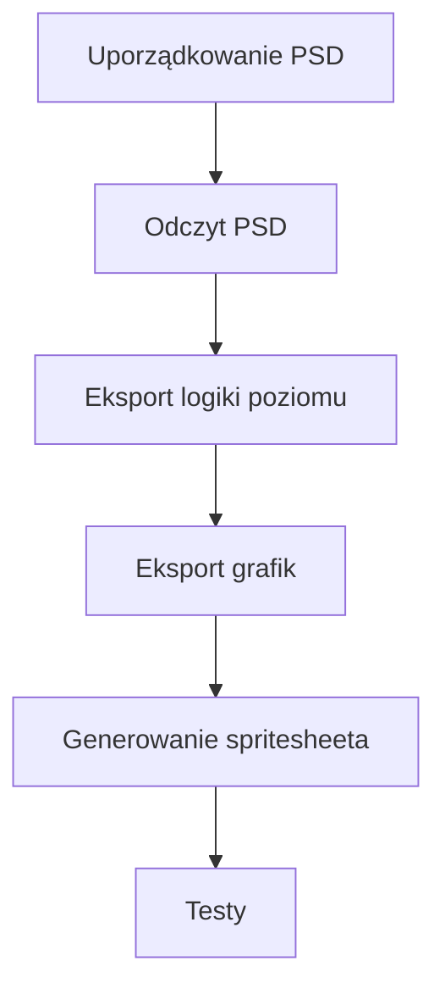

## Kontekst

Na początku lat 2010. CyberCradle przenosiło casualowe gry z PC na iOS przy użyciu autorskiego silnika. Grafika istniała już w plikach Photoshopa; interakcje należało przebudować pod kątem ekranów dotykowych, a każdy poziom musiał zostać przekonwertowany do formatu danych Lua. Pliki PSD od wydawców zawierały setki warstw bez jakiegokolwiek uporządkowanego systemu nazewnictwa.

*Magic Encyclopedia: Moon Light. Jedna scena od wydawcy — nakładające się obiekty i elementy interfejsu ekwipunku.*

Pierwszy port zajął sześć miesięcy. Ręcznie eksportowałem elementy, wpisywałem współrzędne w edytorze tekstu i łączyłem je z maszyną stanów. Ta powtarzalna praca sprawiła, że wąskim gardłem stało się przekazywanie materiałów do silnika, a nie sam game design. Ponadto format PSD nie posiadał wówczas prostych narzędzi do parsowania z zewnątrz. Mając wiedzę z C++ ze studiów, stworzyłem swoje pierwsze narzędzie produkcyjne.

## Wkład

**Czas trwania.** Pierwszy tytuł: 6 miesięcy; kolejne: 3–4 miesiące

**Rola.** Game Designer & QA

**Zespół.** Samodzielnie (potok danych)

### Ograniczenia

- Autorski silnik, dedykowany format Lua dla poziomów i logiki gry
- Pliki PSD od wydawców: setki warstw bez konwencji nazewniczej
- Format PSD nieprzystosowany do bezpośredniego zewnętrznego parsowania
- Mechanika dotykowa pisana od nowa w miejsce sterowania myszą

### Co wymagało decyzji projektowej

- Mój pierwszy kod wdrożony produkcyjnie
- Przekształcenie warstw graficznych w niezawodne dane poziomów
- Konwencja nazewnictwa kodująca obiekt oraz jego zachowanie
- Dopasowanie generowanych danych do formatu Lua wymaganego przez silnik

*Od uporządkowanego pliku PSD do grywalnego, gotowego do testów poziomu.*

## Proces

### Uporządkowanie i przewidywalność PSD

Ustaliłem prostą regułę nazewnictwa dla pliku źródłowego: usunąć lub scalić warstwy nieinteraktywne, a warstwom interaktywnym nadać nazwy łączące obiekt z funkcją. Przygotowanie pliku stało się kontraktem wejściowym zamiast powtarzalnego, ręcznego eksportu.

### Odczyt tylko tych danych, których potrzebował silnik

Parser odczytywał nazwę warstwy, pozycję x/y oraz wymiary ramki — to wystarczało, by zmapować plik graficzny na format poziomów w Lua. Plik PSD pozostał narzędziem pracy projektanta, podczas gdy parser przejął monotonną pracę integracyjną.

### Eksport i testowanie w jednej pętli

Narzędzie generowało logikę poziomu w Lua, eksportowało grafikę i składało arkusz sprajtów (spritesheet). Zespół QA mógł natychmiast testować poziom bezpośrednio w silniku, zamiast odkrywać błędy pozycjonowania po wielogodzinnym ręcznym eksporcie.

## Rezultaty

Narzędzie przekształcało uporządkowany plik PSD w gotowy do testów poziom, zachowując oryginalny plik graficzny w nienaruszonym stanie.

- Czas wdrożenia kolejnych tytułów spadł z 6 miesięcy do 3–4 miesięcy
- Zaoszczędzony czas przeznaczono na testy QA i dopracowanie rozgrywki
- Powtarzalny potok pozwolił studiu na rozwój zespołu i realizację większej liczby kontraktów wydawniczych
