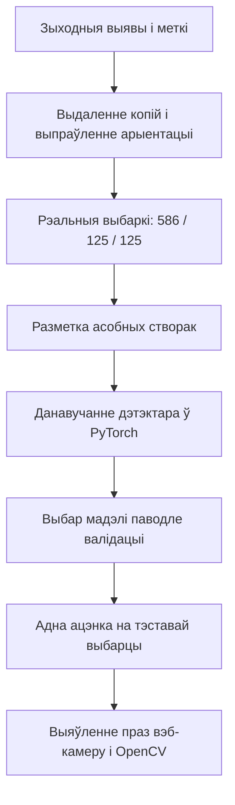
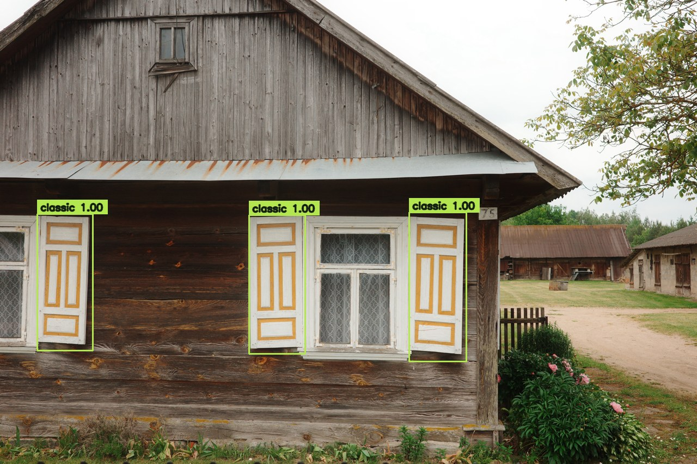
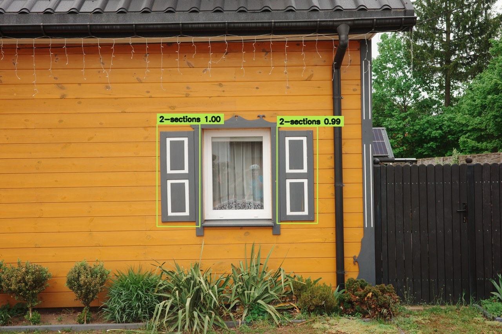
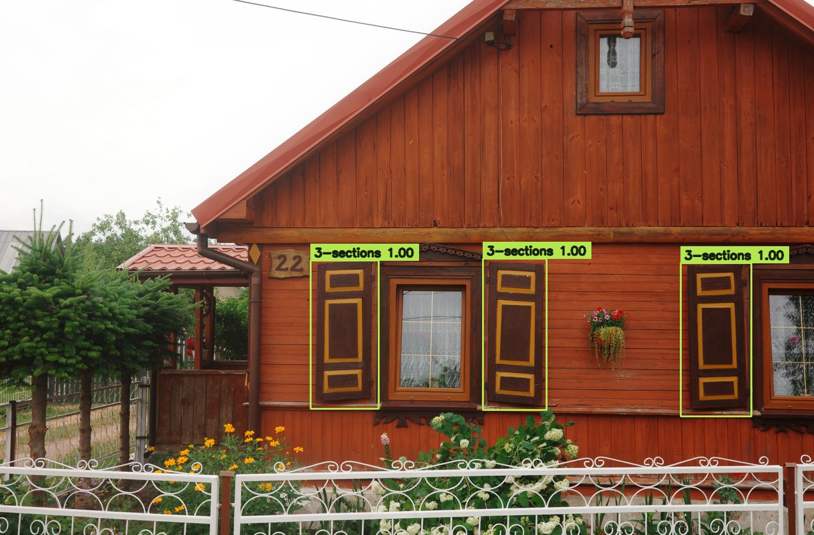
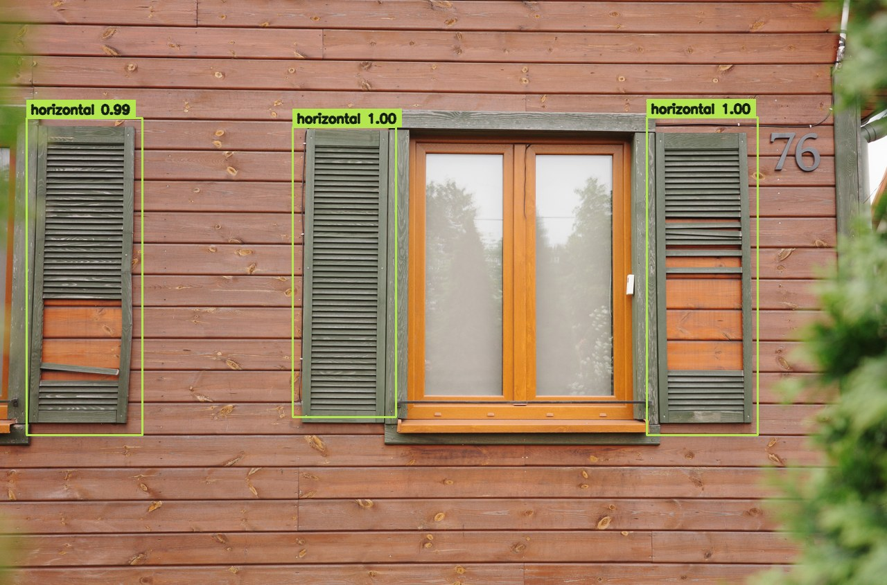
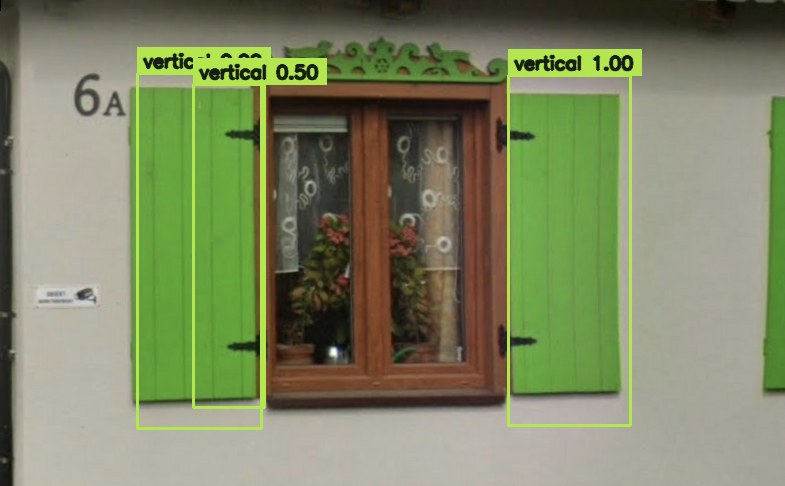

## Ад фатаграфій да выяўлення ў рэальным часе

У аднаго акна можа быць некалькі створак аканіц. Мадэль павінна знайсці кожную і вызначыць яе тып, нават калі на здымку бачны ўвесь дом. Я пабудаваў увесь працэс: ад падрыхтоўкі даных і разметкі да навучання, ацэнкі і працоўнага прататыпа з вэб-камерай.

```video
src: shutter-detector/demo.mp4
poster: shutter-detector/demo-poster.jpg
title: Выяўленне аканіц з PyTorch і OpenCV у рэальным часе
caption: Дэманстрацыя з вэб-камерай і надрукаванай фатаграфіяй. Мадэль знаходзіць дзве асобныя створкі і пазначае іх як двухсекцыйныя. Гэта прыклад працы, а не замер якасці ў палявых умовах.
```

## Кантэкст

Пачатковая калекцыя змяшчала 3 532 файлы з меткамі для цэлых здымкаў. Такія меткі не тлумачаць дэтэктару, дзе пачынаецца і заканчваецца аканіца. Абрэзаныя копіі таксама маглі трапіць у розныя выбаркі і сказіць вынікі праверкі.

Задача падзялілася на дзве часткі: падрыхтаваць надзейную разметку асобных створак і праверыць, ці можа кампактны дэтэктар адрозніваць сем тыпаў аканіц на новых рэальных здымках.

## Праца над праектам

**Аб’ём.** Падрыхтоўка даных, інструмент разметкі на OpenCV, разметка створак, навучанне мадэлі, ацэнка і выяўленне праз камеру. Базавая мадэль навучалася 30 эпох на Apple MPS; агульная працягласць праекта не фіксавалася.

**Роля.** Рэалізацыя поўнага працэсу працы з данымі і мадэллю.

**Абмежаванні.** Меткі толькі на ўзроўні здымка, розная арыентацыя выяў, абрэзаныя дублікаты, нераўнамерная колькасць прыкладаў па класах і лакальнае абсталяванне. Найскладаней было ўзгадніць даныя і забяспечыць сумленную ацэнку яшчэ да наладкі мадэлі.

## Надзейны набор даных

Я вылучыў 2 262 незалежныя зыходныя выявы і выключыў квадратныя вытворныя копіі, каб пазбегнуць уцечкі паміж выбаркамі. Пілотны набор склаў 836 рэальных здымкаў: усе прыклады некласічных аканіц і 400 рэпрэзентатыўных прыкладаў класічных. Дэтэрмінаванае раздзяленне пакінула 586 здымкаў для навучання, 125 для валідацыі і 125 для фінальнага тэсту.

Праграма разметкі падтрымлівае некалькі рамак на здымку, выпраўленне класа асобнай створкі, выдаленне памылак, аўтазахаванне і працяг перапыненай працы. Я праверыў усе 836 здымкаў і размеціў 2 378 створак; на дзевяці здымках прыдатных створак не было. Апрацоўка EXIF узгадняе арыентацыю выявы, захаваныя памеры і каардынаты рамак.

Выніковыя класы: **класічныя, двухсекцыйныя, трохсекцыйныя, гарызантальныя, вертыкальныя, свірнавыя і іншыя**. Рэдкія зыходныя меткі аб’яднаны ў клас «іншыя». Асобныя 330 выяў, створаных ШІ, пакінуты для магчымых эксперыментаў з навучаннем. Апісаная базавая мадэль выкарыстоўвала толькі рэальныя здымкі.



## Навучанне дэтэктара

Я данавучыў **Faster R-CNN MobileNetV3 320-FPN** з Torchvision, папярэдне навучаны на COCO, і замяніў галоўку прадказанняў на сем класаў аканіц і фон. Гарызантальныя адлюстраванні з пералікам рамак і ўмераныя змены яркасці і кантрасту дадалі разнастайнасці без пашкоджання разметкі.

Працэс падтрымлівае працяг з захаванага стану і аўтаматычны выбар CUDA, Apple MPS або CPU. Пасля 30 эпох найлепшай засталася мадэль з **18-й эпохі**: валідацыйны mAP **0.2970**, AP50 **0.4649**. Апошняя эпоха не лічылася найлепшай аўтаматычна.

## Што бачыць мадэль

Гэтыя пяць адабраных прыкладаў узяты з рэальнай тэставай выбаркі. PyTorch прадказвае рамкі, класы і ўпэўненасць, а OpenCV малюе іх на здымках. Паказаны ўсе прадказанні з упэўненасцю **ад 0.50**, у тым ліку недакладныя рамкі і перакрыцці. Прыклады ілюструюць працу мадэлі, але не замяняюць поўных вынікаў тэсту.

### Класічныя аканіцы



### Двухсекцыйныя аканіцы



### Трохсекцыйныя аканіцы



### Гарызантальныя аканіцы



### Вертыкальныя аканіцы



## Вынік

Абраная мадэль дасягнула **mAP 0.3390**, **AP50 0.5301** і **AP75 0.3825** на незалежнай тэставай выбарцы са 125 рэальных здымкаў. COCO mAP асерадняе сярэднюю дакладнасць выяўлення па парогах IoU ад 0.50 да 0.95; AP50 выкарыстоўвае IoU 0.50. Гэта метрыкі выяўлення аб’ектаў, а не працэнт правільна класіфікаваных фатаграфій.

Пры парозе ўпэўненасці 0.50 клас класічных аканіц дасягнуў **дакладнасці 88.1%** і **паўнаты 79.1%**. AP па класах: 0.5149 для класічных, 0.4680 для двухсекцыйных, 0.5052 для трохсекцыйных, 0.3469 для гарызантальных і 0.3753 для вертыкальных аканіц.

Вынік — працоўны прататып ад разметкі да выяўлення. OpenCV атрымлівае кадры з вэб-камеры і паказвае меткі, упэўненасць і бягучую частату кадраў побач з прадказаннямі PyTorch.

## Абмежаванні і наступныя крокі

**Свірнавыя і іншыя аканіцы пакуль выяўляюцца ненадзейна**: AP складае 0.0631 і 0.0995. AP для малых аб’ектаў — толькі 0.0164, таму далёкія створкі таксама застаюцца слабым месцам. Наступны крок — больш незалежных размечаных прыкладаў рэдкіх класаў і дробных аканіц, затым валідацыя перад чарговай фінальнай ацэнкай.

Дэманстрацыя з надрукаванай фатаграфіяй пацвярджае, што працэс выяўлення працуе. Яна не даказвае надзейнасці пры розным вулічным асвятленні, руху камеры ці на новых архітэктурных стылях.
