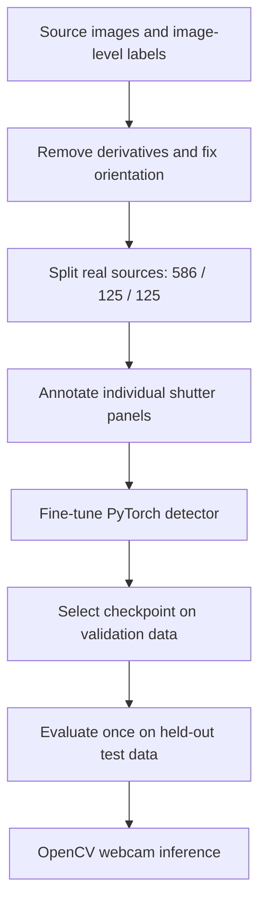

## From photographs to live detection

A window can have several shutter panels. The model needs to locate each one and predict its type, even when the photograph includes a whole house. I built the workflow from dataset preparation and annotation through training, evaluation, and a working webcam prototype.

```video
src: shutter-detector/demo.mp4
poster: shutter-detector/demo-poster.jpg
title: Live shutter detection with PyTorch and OpenCV
caption: Webcam demonstration with a printed photograph. The model detects two individual panels and labels them as two-section shutters. This is a qualitative demo, not a field-performance benchmark.
```

## Context

The collection started with 3,532 image files and labels describing entire images. Those labels could not teach a detector where a shutter begins and ends. Cropped duplicates also risked putting versions of the same photograph in both training and evaluation.

The task became two linked problems: build trustworthy panel-level training data, then test whether a compact detector could distinguish seven shutter types on unseen real images.

## Effort

**Scope.** Dataset preparation, an OpenCV annotation tool, panel-level labeling, model training, evaluation, and live inference. The baseline ran for 30 epochs on Apple MPS; elapsed project time was not recorded.

**Role.** End-to-end implementation of the data and model workflow.

**Constraints.** Image-level labels, mixed image orientations, duplicate crops, uneven class coverage, and local training hardware. The difficult part was making the data consistent and the evaluation credible before tuning the model.

## Building a trustworthy dataset

I identified 2,262 independent source images and excluded square derivatives to prevent split leakage. The real-image pilot contained 836 images: all non-classic real examples plus 400 representative classic examples. Deterministic splits reserved 586 for training, 125 for validation, and 125 for the final test.

The annotation app supports multiple boxes per image, per-panel class correction, undoing mistakes, autosave, and resumable review. I reviewed all 836 images and produced 2,378 shutter-panel boxes; nine images had no usable panels. EXIF orientation handling keeps the displayed image, stored dimensions, and box coordinates aligned.

The final labels are **classic, 2-sections, 3-sections, horizontal, vertical, barn, and other**. Rare original labels were grouped into “other.” A separate set of 330 AI-generated images was reserved for optional training experiments; the reported baseline used real images only.



## Training the detector

I fine-tuned Torchvision’s COCO-pretrained **Faster R-CNN MobileNetV3 320-FPN**, replacing its prediction head with seven shutter classes plus background. Box-safe horizontal flips and modest brightness and contrast changes added variation without breaking annotations.

The pipeline supports resumable checkpoints and automatic CUDA, Apple MPS, or CPU selection. After 30 epochs, **epoch 18** remained the best validation checkpoint, with mAP **0.2970** and AP50 **0.4649**. The final epoch was not automatically treated as the best model.

## What the model sees

These five curated examples come from the real test split. PyTorch predicts the boxes, classes, and scores; OpenCV draws the overlays. All predictions at confidence **0.50 or above** are shown, including imperfect or overlapping detections. These are illustrative examples, not a replacement for the full test results.

### Classic shutters


### Two-section shutters


### Three-section shutters


### Horizontal shutters


### Vertical shutters


## Outcome

The selected checkpoint reached **mAP 0.3390**, **AP50 0.5301**, and **AP75 0.3825** on the untouched 125-image real test split. COCO mAP averages detection precision over IoU thresholds from 0.50 to 0.95; AP50 uses IoU 0.50. These are detection metrics, not a percentage of correctly classified photographs.

At confidence 0.50, the classic class achieved **88.1% precision** and **79.1% recall**. Per-class AP was 0.5149 for classic, 0.4680 for two-section, 0.5052 for three-section, 0.3469 for horizontal, and 0.3753 for vertical shutters.

The result is a working annotation-to-inference prototype. OpenCV captures webcam frames and renders labels, confidence scores, and rolling FPS around the PyTorch predictions.

## Limits and next steps

**Barn and other remain unreliable**, with AP of 0.0631 and 0.0995. Small-object AP is only 0.0164, so distant panels are another clear weakness. The next step is more independent, annotated examples of rare classes and small shutters, followed by validation before another final evaluation.

The printed-photo webcam demonstration confirms the inference loop works. It does not establish reliability across outdoor lighting, camera motion, or new architectural styles.
