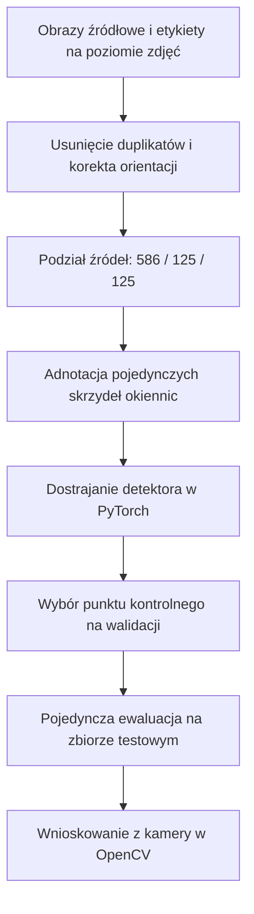
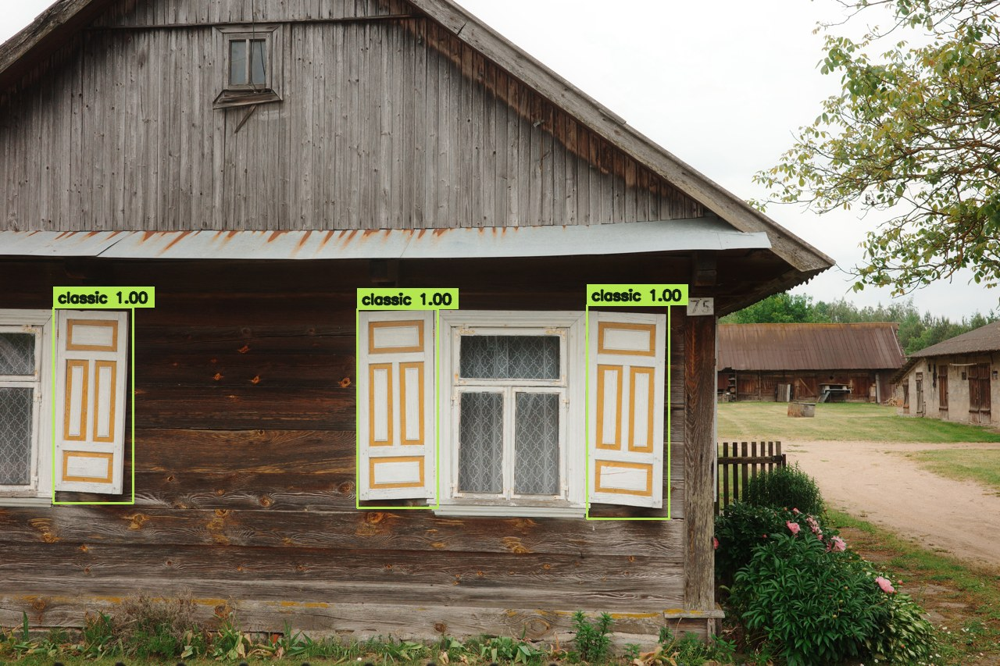
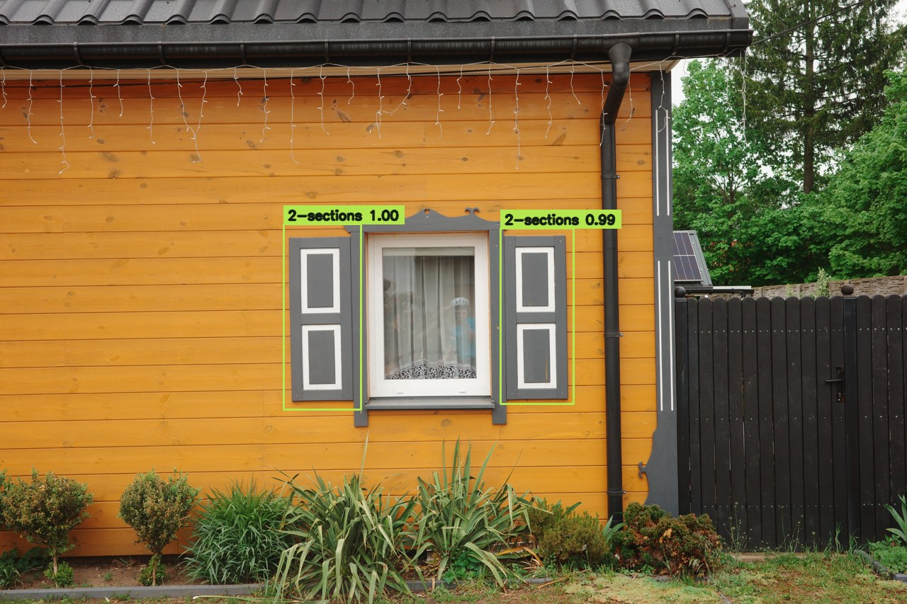
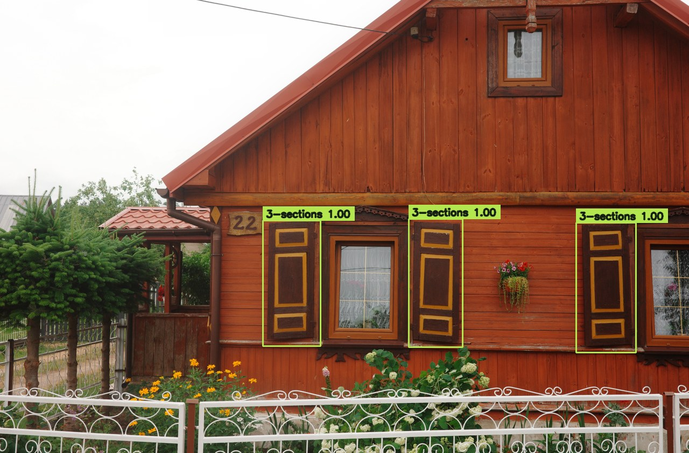
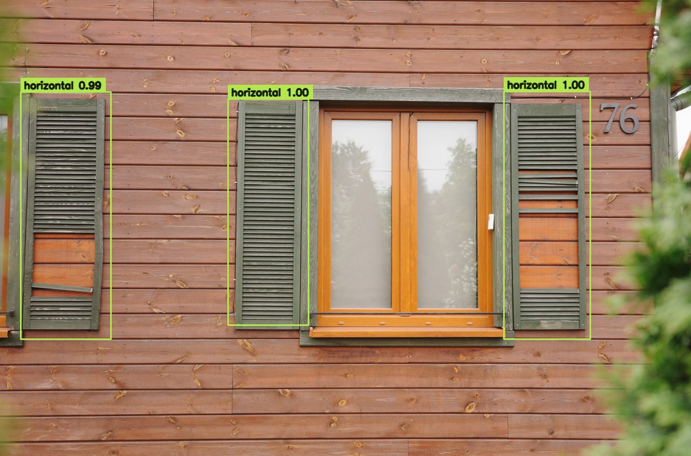

## Od fotografii do detekcji na żywo

Jedno okno może mieć kilka skrzydeł okiennic. Model musi zlokalizować każde z nich i rozpoznać jego typ, nawet gdy zdjęcie przedstawia cały dom. Zaprojektowałem i wdrożyłem cały potok pracy: od przygotowania zbioru danych i adnotacji, przez trening i ewaluację, aż po działający prototyp z kamerą internetową.

```video
src: shutter-detector/demo.mp4
poster: shutter-detector/demo-poster.jpg
title: Detekcja okiennic na żywo w PyTorch i OpenCV
caption: Demonstracja z kamerą internetową i wydrukowanym zdjęciem. Model wykrywa dwa pojedyncze skrzydła i klasyfikuje je jako okiennice dwusekcyjne. To demonstracja jakościowa, a nie benchmark wydajności polowej.
```

## Kontekst

Kolekcja liczyła początkowo 3 532 pliki graficzne z etykietami opisującymi całe zdjęcia. Takie etykiety nie pozwalały nauczyć detektora, gdzie skrzydło się zaczyna, a gdzie kończy. Przycięte duplikaty niosły też ryzyko trafienia wariantów tego samego zdjęcia zarówno do zbioru treningowego, jak i testowego.

Zadanie przekształciło się w dwa połączone wyzwania: stworzyć rzetelny zbiór danych treningowych z adnotacjami na poziomie skrzydeł, a następnie sprawdzić, czy kompaktowy detektor poradzi sobie z rozróżnieniem siedmiu typów okiennic na nieznanych wcześniej, rzeczywistych fotografiach.

## Wkład

**Zakres.** Przygotowanie zbioru danych, narzędzie adnotacji w OpenCV, etykietowanie na poziomie skrzydeł, trening modelu, ewaluacja oraz wnioskowanie na żywo. Model bazowy trenowano przez 30 epok na Apple MPS; łączny czas projektu nie był rejestrowany.

**Rola.** Kompleksowa realizacja przepływu danych i architektury modelu.

**Ograniczenia.** Etykiety na poziomie całych obrazów, zróżnicowana orientacja zdjęć, zduplikowane kadry, nierównomierny rozkład klas oraz lokalny sprzęt obliczeniowy. Najtrudniejszym etapem było zapewnienie spójności danych i wiarygodności ewaluacji przed rozpoczęciem dostrajania modelu.

## Budowa rzetelnego zbioru danych

Zidentyfikowałem 2 262 niezależne obrazy źródłowe i wykluczyłem kwadratowe kadry pochodne, aby zapobiec wyciekowi danych między podzbiorami. Pilotażowy zbiór rzeczywistych zdjęć liczył 836 obrazów: wszystkie nieklasyczne przykłady rzeczywiste oraz 400 reprezentatywnych przykładów klasycznych. Deterministyczny podział wydzielił 586 do treningu, 125 do walidacji i 125 do końcowego testu.

Aplikacja do adnotacji obsługuje wiele ramek na obraz, korektę klasy dla pojedynczego skrzydła, cofanie operacji, autozapis i możliwość wznowienia pracy. Przejrzałem wszystkie 836 zdjęć, tworząc 2 378 ramek okiennic; dziewięć zdjęć nie zawierało użytecznych obiektów. Obsługa orientacji EXIF dba o zachowanie zgodności wyświetlanego obrazu, zapisanych wymiarów i współrzędnych ramek.

Końcowe etykiety to: **classic, 2-sections, 3-sections, horizontal, vertical, barn i other**. Rzadkie pierwotne kategorie zgrupowano w „other”. Oddzielny zbiór 330 obrazów wygenerowanych przez AI zachowano do opcjonalnych eksperymentów; model bazowy wykorzystywał wyłącznie zdjęcia rzeczywiste.



## Trening detektora

Dostroiłem model **Faster R-CNN MobileNetV3 320-FPN** (wstępnie wytrenowany na COCO w Torchvision), zastępując głowicę predykcyjną siedmioma klasami okiennic oraz tłem. Bezpieczne dla ramek odbicia lustrzane oraz umiarkowane korekty jasności i kontrastu zwiększyły różnorodność bez naruszania adnotacji.

Potok obsługuje wznawianie z punktów kontrolnych i automatyczny wybór CUDA, Apple MPS lub CPU. Po 30 epokach najlepszym punktem kontrolnym na zbiorze walidacyjnym okazała się **epoka 18**, osiągając mAP **0.2970** i AP50 **0.4649**. Ostatnia epoka nie była automatycznie uznawana za najlepszy model.

## Co widzi model

Poniższe cztery przykłady pochodzą z rzeczywistego zbioru testowego. PyTorch przewiduje ramki, klasy i pewność; OpenCV nanosi nakładki graficzne. Pokazano wszystkie predykcje o pewności **0.50 lub wyższej**, w tym niedoskonałe i nakładające się detekcje. Są to przykłady ilustracyjne, a nie zamiennik pełnych wyników testowych.

### Okiennice klasyczne



### Okiennice dwusekcyjne



### Okiennice trzysekcyjne



### Okiennice poziome



## Wyniki

Wybrany punkt kontrolny osiągnął **mAP 0.3390**, **AP50 0.5301** oraz **AP75 0.3825** na nienaruszonym zbiorze testowym 125 rzeczywistych obrazów. COCO mAP uśrednia precyzję detekcji w progach IoU od 0.50 do 0.95; AP50 stosuje próg IoU 0.50. Są to metryki detekcji obiektów, a nie odsetek poprawnie sklasyfikowanych fotografii.

Przy progu pewności 0.50 klasa klasyczna osiągnęła **88.1% precyzji (precision)** i **79.1% czułości (recall)**. Wartość AP dla poszczególnych klas wyniosła 0.5149 dla klasycznych, 0.4680 dla dwusekcyjnych, 0.5052 dla trzysekcyjnych, 0.3469 dla poziomych oraz 0.3753 dla pionowych.

Rezultatem jest działający prototyp od adnotacji do wnioskowania. OpenCV przechwytuje obraz z kamery internetowej i renderuje etykiety, wskaźniki pewności oraz płynny licznik FPS wokół predykcji PyTorch.

## Ograniczenia i kolejne kroki

**Klasy „barn” oraz „other” pozostają niestabilne**, z wartościami AP na poziomie 0.0631 i 0.0995. AP dla małych obiektów wynosi zaledwie 0.0164, dlatego oddalone skrzydła stanowią wyraźną słabość modelu. Kolejnym krokiem jest pozyskanie większej liczby niezależnych, oznaczonych przykładów rzadkich klas i małych okiennic, a następnie walidacja przed ponowną ewaluacją końcową.

Demonstracja z wydrukowanym zdjęciem i kamerą potwierdza prawidłowe działanie pętli wnioskowania. Nie dowodzi jednak niezawodności w zmiennym oświetleniu zewnętrznym, przy ruchu kamery czy w zestawieniu z nowymi stylami architektonicznymi.
