## Кантекст

Платформа была B2B-агрэгатарам стрымінгу. Кожны тытул патрабаваў постараў пад любы макет: адна геаметрыя, каб сетка трымалася, некалькі скінаў, некалькі прапорцый, і png, webp або progressive jpeg у big, medium, small і tiny — каб кожная паверхня магла мяняць якасць на хуткасць.

Каталог не стаяў. Падключаліся новыя правайдары; ужо падключаныя дадавалі прэм'еры. Ручны збор не паспяваў. Пайплайн мусіў глядзець спачатку прадакшн, потым pre-release сырую базу: ранняя праца з сырымі данымі — тое, што не дае тытулу выйсці без постара.
## Намаганні

**Працягласць.** 1 год

**Роля.** Design Engineer

**Каманда.** Аднаасобна

### Абмежаванні

- Каталог рос ад новых правайдараў і прэм'ер
- Арыгіналы ад правайдара прыходзілі павольна і ў розных фарматах
- Публічныя каталогі стаялі за Cloudflare
- Раннія мадэлі збіваліся са стылю і не мелі роднай празрыстасці

### Што было складана

- Адны правілы кропу і геаметрыі на дзясяткі тысяч тытулаў
- Назвы ў адзін, два або тры радкі негатыўнай прасторы
- Твары на адной гарызанталі, сілуэты па цэнтры
- Тытр чытэльны на светлым арце

*Ад змены каталога да дастаўкі.*

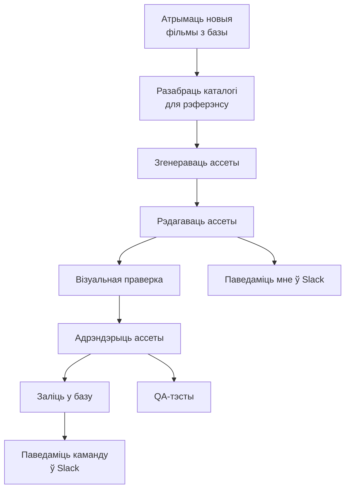

## Працэс

### Падцягнуць каталог

n8n спрацоўвае на змену ў базе і запускае дызайн-ланцуг. Прадакшн — прыярытэт; сырая база правайдара — другая. Трымаць гэтую сырую базу актуальнай — тое, што не дае тытулу выйсці без постара.

*Апытанне production і pre-production; паўтор, пакуль новыя тытулы не трапяць у Workspace / RAW.*

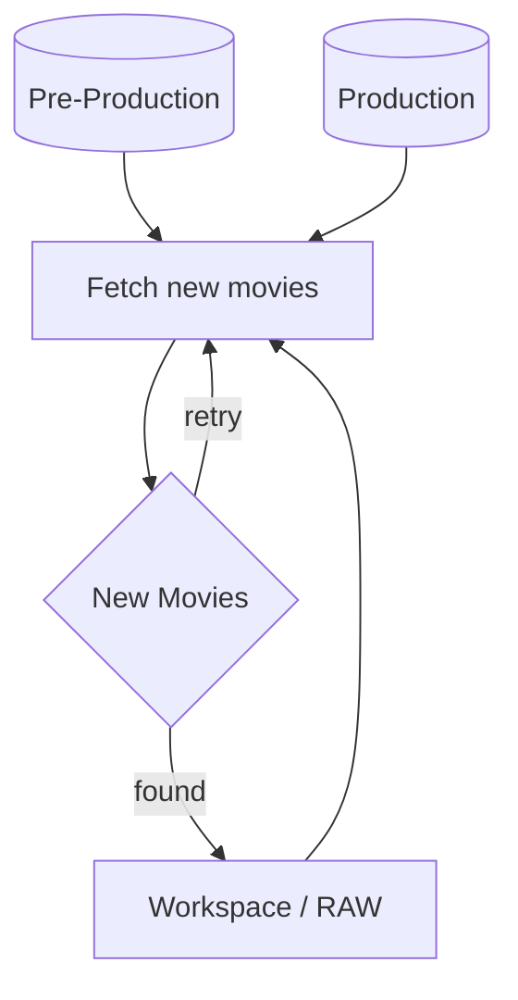

### Зібраць рэферэнсы

Параўнанне каталога з лакальным сховішчам — і з'яўляецца to-do: тытулы без постара. Файлы правайдара дрэнна аўтаматызуюцца: павольна, кожны раз іншы фармат. Спачатку публічныя кадры: IMDb і Rotten Tomatoes пакрываюць большасць каталога; рэгіянальныя і нішавыя фільмы — з афіцыйнага сайта або пошуку выяў. Playwright не праходзіў Cloudflare. Chrome CDP, з адным чалавечым праходам на сесію, праходзіў. Рэферэнсы жылі ў Obsidian.

*Фолбэк постара: IMDB, афіцыйны сайт, потым Google Images.*

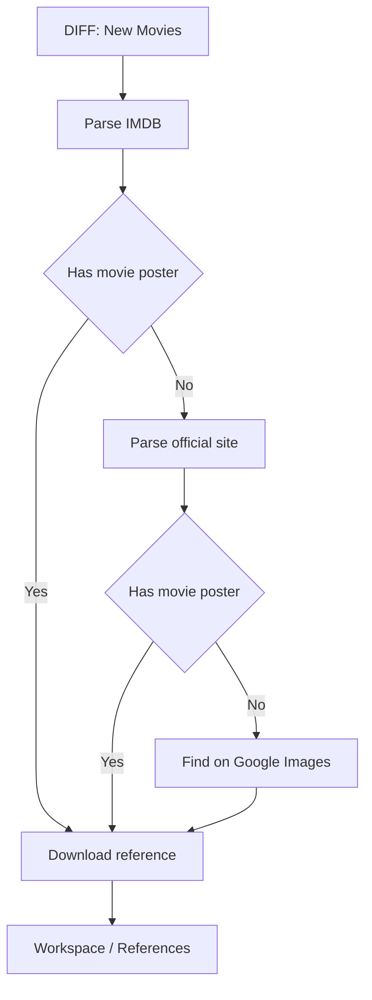

### Згенераваць слаі

Кансістэнтнасць — адна і тая ж дэканструкцыя кожнага постара: пярэдні план (чалавек, жывёла, аб'ект), фон, унікальны тытр. Кожны слой мае ўласны промпт да рэферэнса — фон без надпісу і буйнога аб'екта; пярэдні план не абрэзаны, на празрыстым; тытр 2:1, таксама празрысты. Спачатку быў Gemini (Nano Banana). Ён збіваўся са стылю, галюцынаваў і не меў альфы. Празрыстасць можна зрабіць скрыптам або Photoshop batch, але краі чысцейшыя, калі мадэль аддае яе сама. Перайшоў на GPT Images 2.0, калі з'явілася API.

*Паралельная GPT-генерацыя фону, персанажа і ўнікальнага тытра.*

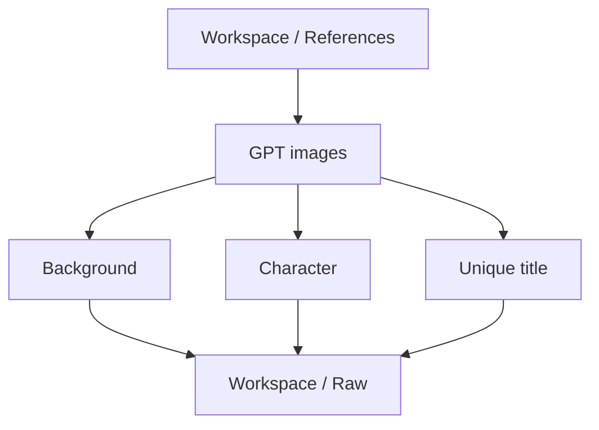

### Агульны тытр

Некаторым кліентам агрэгатара патрэбны быў адзін тытр на ўвесь каталог — больш кантрасту, герой трымае ўвагу. Складанае — запоўніць негатыўную прастору і падзяліць назву на адзін, два або тры радкі так, каб яна чыталася. Калі арыгінальны тытр чытэльны, OCR захоўвае гэты падзел. Калі не — Python-скрыпт.

*Зчытаць тытр з рэферэнса; разбіць, калі больш за тры радкі.*

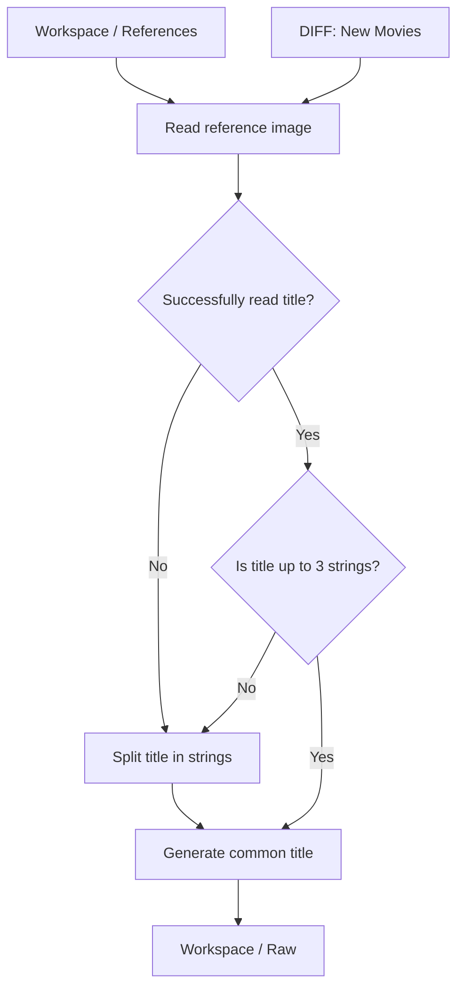

### Падладзіць слаі

Фон і тытр — лёгкая праца: кроп (мадэлі часам пакідаюць белую рамку), водступ для тытра, рэсайз. Пярэдні план патрабуе кропкі цікавасці. Дэтэкт твару і сілуэту. Усе твары на адной гарызанталі; сілуэты ў цэнтры кадра. Кроп ад гэтых кропак з мінімальнай стратай. Пераменная мінімальнага памеру твару кантралюе, наколькі буйны герой.

*Рэсайз фону і тытра ў Workspace / Raw.*

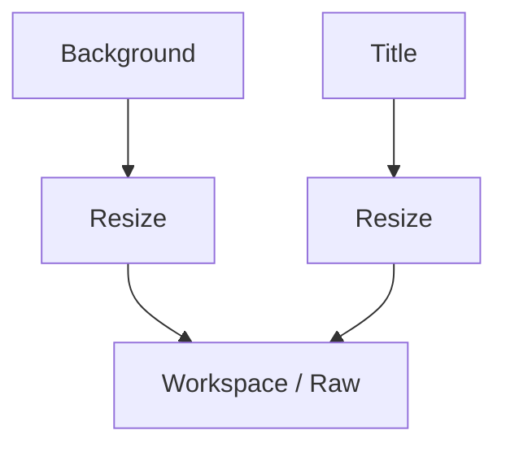

*Кроп персанажа па межах твару і цела.*

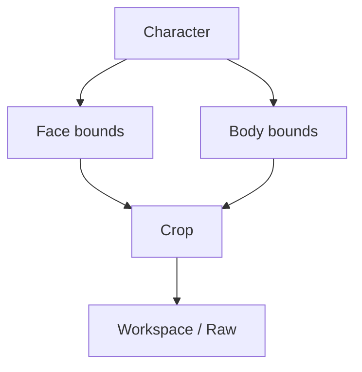

### Рэндэр

Складае кожную патрэбную прапорцыю, памер, фармат, скін і імя файла. Фон заўсёды запаўняе кадр. Герой у цэнтры, без рэсайзу. Унікальны або агульны тытр — унізе па цэнтры; памяншаецца, калі кадр вузейшы за 1:1. Некаторыя скіны маюць падкладку — каляровы або чорны градыент для кантрасту тытра. Адценне з фону: маштаб да 9×9 і колер цэнтральнага пікселя. На светлым арце белае ўсё роўна правальваецца, таму пайплайн выбірае з 16 адценняў поўнага кола з тым жа кантрастам белага на колеры. Астатняе — Pillow.


*Адна геаметрыя ў дзевяці прапорцыях. Персанаж застаецца па цэнтры; тытр унізе па цэнтры і памяншаецца на вузейшых кадрах.*


*Чатыры памеры файла — tiny, small, medium, large — каб кожная паверхня магла мяняць якасць на хуткасць.*

*Кожны рэндэр праходзіць прапорцыю, фармат, памер і скін.*

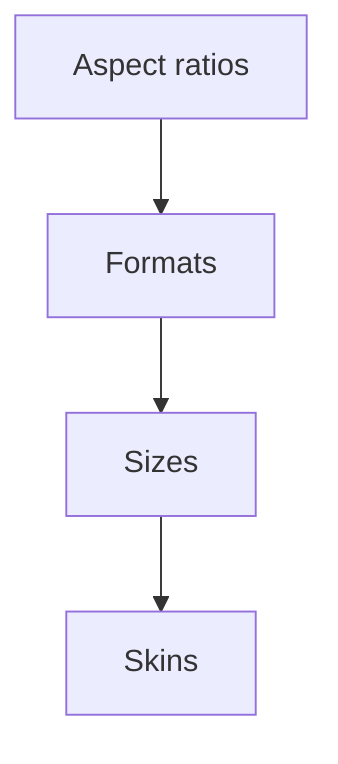

*Кампазіцыя на палатне з галінамі падкладкі, тытра і брэндынгу. Персанаж застаецца па цэнтры і без рэсайзу.*

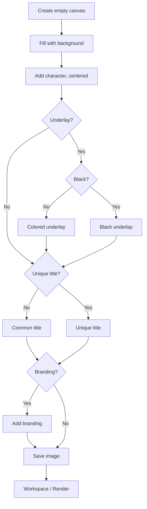

```widget
id: thumbnail-pipeline
```

### Лакальны AI QA

Дзве праверкі: колькі празрыстых пікселяў засталося ў тытры, і ці супадае рэндэр з рэферэнсам. Падлік пікселяў — проста. Параўнанне выяў не мусіць быць хуткім — Gemma 4 праз Ollama ішла ноччу, станцыя не прастойвала. У Obsidian — арыгінал і рэндэр плюс абодва балы. Сартаванне па бале само складае чаргу. Плагін запускае shell-скрыпт са сховішча, таму тая ж дошка — і панэль кіравання.

*Рэндэр супраць рэферэнса праз Gemma4.*

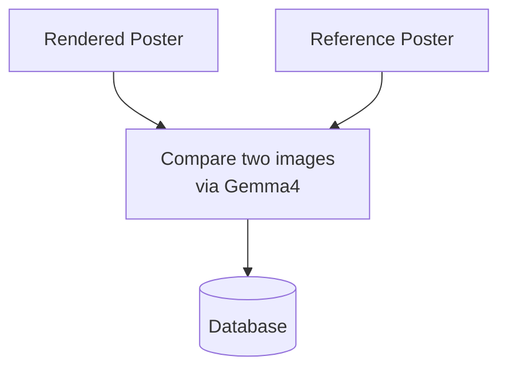

*Падлік празрыстых пікселяў на агульным тытры.*

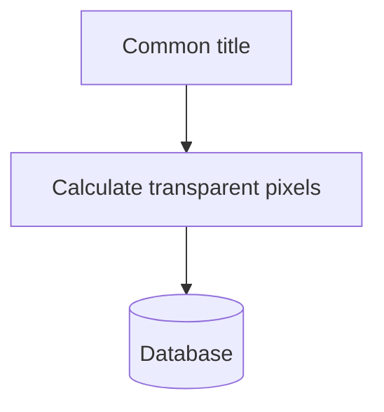

### Дастаўка праз watchfolder

Апошні крок самы просты, і яго таксама можна аўтаматызаваць. Watchfolder на рабочай папцы загружае, апавяшчае, сінхранізуе і робіць бэкап.

## Рашэнне

Слаі RAW па movie ID. Рэндэры з імем скін, прапорцыя і памер. Рэферэнсы і QA-балы — у сховішчы Obsidian.

*Слаі RAW па movie ID.*

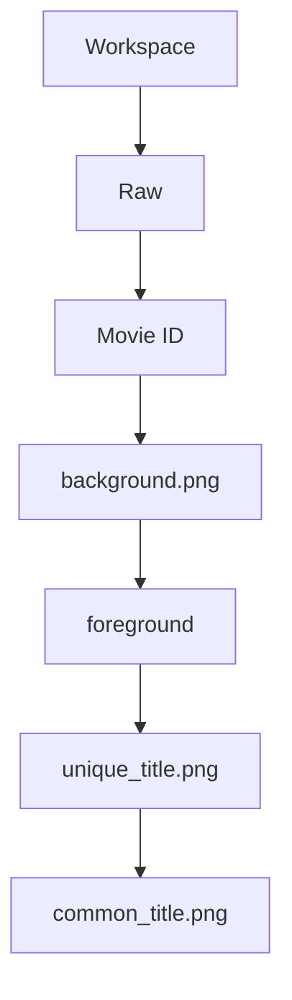

*Сховішча Obsidian: рэндэры з імем скін, прапорцыя і памер; рэферэнсы па movie ID.*

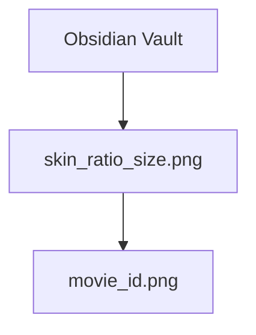

*Палі базы ў сховішчы: тытры, постары і QA-балы.*

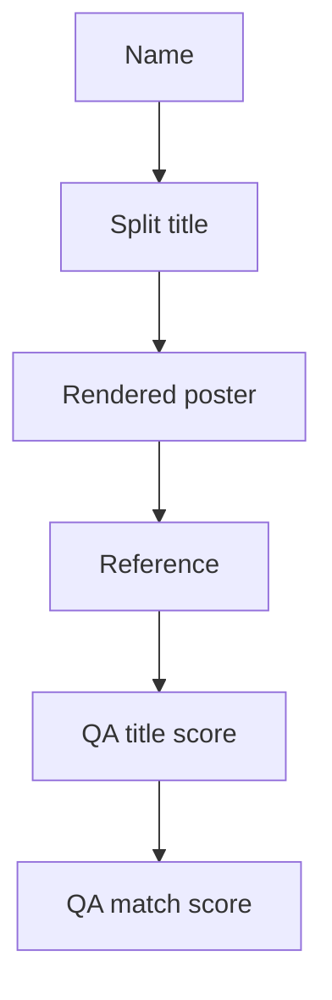

## Вынік

- Амаль 30 000 тамбнейлаў за год
- Зэканомленыя сотні тысяч еўра
- Змены каталога запускаюць увесь ланцуг без ручнога збору
