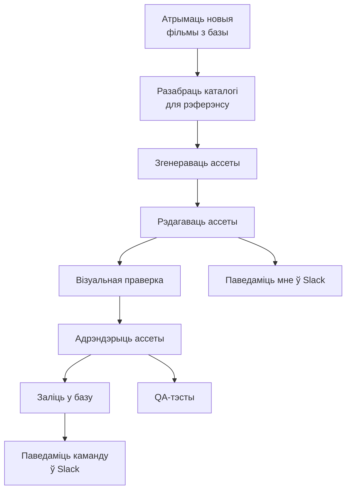
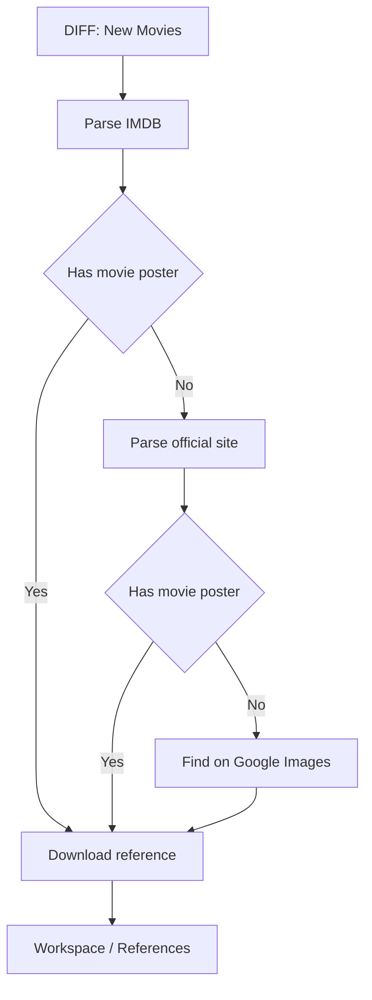
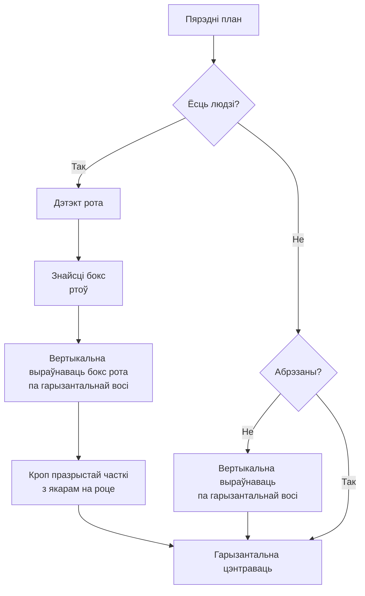
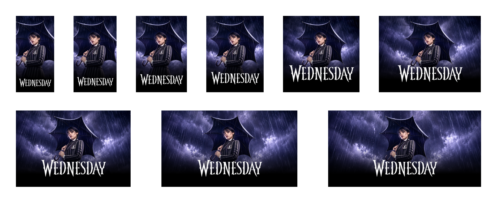
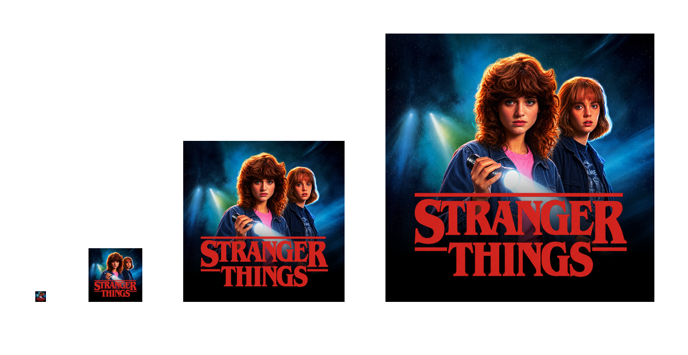
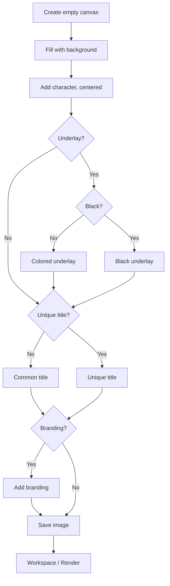

## Кантекст

Платформа была B2B-агрэгатарам стрымінгу. Кожны тытул патрабаваў постараў пад любы макет: адна геаметрыя, каб сетка трымалася, некалькі скінаў, некалькі прапорцый, і png, webp або progressive jpeg у big, medium, small і tiny — каб кожная паверхня магла мяняць якасць на хуткасць.

Каталог не стаяў. Падключаліся новыя правайдары; ужо падключаныя дадавалі прэм'еры. Ручны збор не паспяваў. Пайплайн мусіў глядзець спачатку прадакшн, потым pre-release сырую базу: ранняя праца з сырымі данымі — тое, што не дае тытулу выйсці без постара.

## Намаганні

**Працягласць.** 1 год

**Роля.** Design Engineer

**Каманда.** Аднаасобна

### Абмежаванні

- Каталог рос ад новых правайдараў і прэм'ер
- Арыгіналы ад правайдара прыходзілі павольна і ў розных фарматах
- Публічныя каталогі стаялі за Cloudflare
- Раннія мадэлі збіваліся са стылю і не мелі роднай празрыстасці

### Што было складана

- Адны правілы кропу і геаметрыі на дзясяткі тысяч тытулаў
- Назвы ў адзін, два або тры радкі негатыўнай прасторы
- Рты на адной гарызанталі; абрэзаныя аб'екты прапускаюць вертыкальны крок
- Тытр чытэльны на светлым арце

*Ад змены каталога да дастаўкі.*



## Працэс

### Падцягнуць каталог

n8n спрацоўвае на змену ў базе і запускае дызайн-ланцуг. Прадакшн — прыярытэт; сырая база правайдара — другая. Апытанне ідзе па абедзвюх, з паўторам, пакуль новыя тытулы не трапяць у Workspace / RAW. Трымаць гэтую сырую базу актуальнай — тое, што не дае тытулу выйсці без постара.

### Зібраць рэферэнсы

Параўнанне каталога з лакальным сховішчам — і з'яўляецца to-do: тытулы без постара. Файлы правайдара дрэнна аўтаматызуюцца: павольна, кожны раз іншы фармат. Спачатку публічныя кадры: IMDb і Rotten Tomatoes пакрываюць большасць каталога; рэгіянальныя і нішавыя фільмы — з афіцыйнага сайта або пошуку выяў. Playwright не праходзіў Cloudflare. Chrome CDP, з адным чалавечым праходам на сесію, праходзіў. Рэферэнсы жылі ў Obsidian.

*Фолбэк постара: IMDB, афіцыйны сайт, потым Google Images.*



### Згенераваць слаі

Кансістэнтнасць — адна і тая ж дэканструкцыя кожнага постара: пярэдні план (чалавек, жывёла, аб'ект), фон, унікальны тытр. Кожны слой мае ўласны промпт да рэферэнса — фон без надпісу і буйнога аб'екта; пярэдні план не абрэзаны, на празрыстым; тытр 2:1, таксама празрысты. Спачатку быў Gemini (Nano Banana). Ён збіваўся са стылю, галюцынаваў і не меў альфы. Празрыстасць можна зрабіць скрыптам або Photoshop batch, але краі чысцейшыя, калі мадэль аддае яе сама. Перайшоў на GPT Images 2.0, калі з'явілася API. GPT запускае тры промпты паралельна; вынік кладзецца ў Workspace / Raw.

### Агульны тытр

Некаторым кліентам агрэгатара патрэбны быў адзін тытр на ўвесь каталог — больш кантрасту, герой трымае ўвагу. Складанае — запоўніць негатыўную прастору і падзяліць назву на адзін, два або тры радкі так, каб яна чыталася. Калі арыгінальны тытр чытэльны і ўжо ў адзін–тры радкі, OCR захоўвае гэты падзел. Калі зчытванне не ўдалося або назва даўжэйшая за тры радкі — Python-скрыпт дзеліць, потым агульны тытр генеруецца ў Workspace / Raw.

### Падладзіць слаі

Фон і тытр — лёгкая праца: кроп (мадэлі часам пакідаюць белую рамку), водступ для тытра, рэсайз. Пярэдні план патрабуе кропкі цікавасці.

Людзі: дэтэкт рота, бокс усіх ртоў, і гэты бокс на адной гарызанталі. Празрысты водступ кропіцца з якарам на роце. Без людзей: калі аб'ект ужо абрэзаны, вертыкальны крок прапускаецца; інакш выраўноўваецца на той жа гарызанталі. Потым кожны слой цэнтруецца па гарызанталі. Пераменная мінімальнага памеру твару кантралюе, наколькі буйны герой.

*Кроп пярэдняга плана: рты на адной гарызанталі, потым цэнтр.*



```gallery
- src: streaming-thumbnails/detect-mouth-01.png
  alt: 1670 — два рты ў боксе на адной гарызанталі
- src: streaming-thumbnails/detect-mouth-02.png
  alt: Squid Game — пяць ртоў на адной гарызанталі
- src: streaming-thumbnails/detect-mouth-03.png
  alt: Stranger Things — два рты выраўнаваныя на гарызанталі
- src: streaming-thumbnails/detect-mouth-04.png
  alt: Wednesday — адзін рот на гарызанталі, кроп з якарам там
- src: streaming-thumbnails/detect-mouth-05.png
  alt: BoJack Horseman — абрэзаны аб'ект, вертыкальны крок прапускаецца, потым цэнтр
- src: streaming-thumbnails/detect-mouth-06.png
  alt: Drive to Survive — без людзей; бокс аб'екта выраўнаваны і цэнтраваны
```

*Тыя ж правілы на розных тытулах: рты на адной гарызанталі; абрэзаныя аб'екты прапускаюць вертыкальны крок, потым усё цэнтруецца.*

### Рэндэр

Складае кожную патрэбную прапорцыю, памер, фармат, скін і імя файла. Фон заўсёды запаўняе кадр. Герой у цэнтры, без рэсайзу. Унікальны або агульны тытр — унізе па цэнтры; памяншаецца, калі кадр вузейшы за 1:1. Некаторыя скіны маюць падкладку — каляровы або чорны градыент для кантрасту тытра. Адценне з фону: маштаб да 9×9 і колер цэнтральнага пікселя. На светлым арце белае ўсё роўна правальваецца, таму пайплайн выбірае з 16 адценняў поўнага кола з тым жа кантрастам белага на колеры. Астатняе — Pillow.



*Адна геаметрыя ў дзевяці прапорцыях. Персанаж застаецца па цэнтры; тытр унізе па цэнтры і памяншаецца на вузейшых кадрах.*



*Чатыры памеры файла — tiny, small, medium, large — каб кожная паверхня магла мяняць якасць на хуткасць.*

*Персанаж застаецца па цэнтры і без рэсайзу.*



```widget
id: thumbnail-pipeline
```

### Лакальны AI QA

Дзве праверкі: колькі празрыстых пікселяў засталося ў тытры, і ці супадае рэндэр з рэферэнсам. Падлік пікселяў — проста. Параўнанне выяў не мусіць быць хуткім — Gemma 4 праз Ollama ішла ноччу, станцыя не прастойвала. У Obsidian — арыгінал і рэндэр плюс абодва балы. Сартаванне па бале само складае чаргу. Плагін запускае shell-скрыпт са сховішча, таму тая ж дошка — і панэль кіравання.


*Арыгінал і рэндэр. Той жа герой, тытр і кроп; пайплайн здымае Netflix-шыльду.*

### Дастаўка праз watchfolder

Апошні крок самы просты, і яго таксама можна аўтаматызаваць. Watchfolder на рабочай папцы загружае, апавяшчае, сінхранізуе і робіць бэкап.

## Рашэнне

RAW — у Workspace / Raw, па movie ID: `background.png`, пярэдні план, `unique_title.png`, `common_title.png`. Рэндэры — `skin_ratio_size.png`; рэферэнсы — `movie_id.png`. У сховішчы: назва, падзелены тытр, адрэндэраны постар, рэферэнс, QA-бал тытра і QA-бал супадзення.

## Вынік

- Амаль 30 000 тамбнейлаў за год
- Зэканомленыя сотні тысяч еўра
- Змены каталога запускаюць увесь ланцуг без ручнога збору
