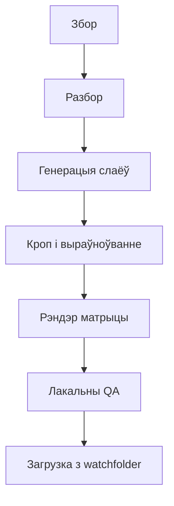

```widget
id: thumbnail-pipeline
```

## Кантекст

Прадукту патрэбныя былі постары, якія выглядалі б адной сістэмай на розных паверхнях, а не наборам асобных ілюстрацый. Кожны тытул выходзіў у васьмі скінах, дзевяці прапорцыях, чатырох памерах (ад large да tiny) і трох фарматах — PNG, WebP і progressive JPEG — з арыгінальным тытрам альбо адным агульным тытрам на каталог кліента. Задача была не намаляваць адзін постар, а задаць геаметрыю, якая трымаецца ва ўсіх камбінацыях.

Wednesday, Stranger Things і BoJack Horseman ніжэй — тытулы з каталога гэтага агрэгатара, а не прадукт Netflix.

Каталог рухаўся пастаянна. Далучаліся новыя правайдары, існыя дадавалі прэм'еры, таму пайплайн спачатку браў production-дадзеныя і ўсё роўна разбіраў pre-release-дампы. Тытул без арту ў продзе — гэта і быў правальны сцэнар.


*n8n вядзе паўторныя крокі: штогадзінны збор і генерацыя, ручны checkpoint рэндэра і загрузкі, штодзённы QA.*

## Намаганні

**Працягласць.** 1 год

**Роля.** Design Engineer

**Каманда.** Аднаасобна

### Абмежаванні

- Арыгіналы ад правайдара прыходзілі павольна і ў розных фарматах
- Раннія мадэлі збіваліся са стылю і не мелі роднай празрыстасці
- Згенераваныя слаі не мелі агульнай сістэмы каардынат
- Агульны тытр павінен быў чытацца ў зоне на адзін–тры радкі; беламу тытру патрэбны быў кантраст на светлым арце

### Што патрабавала рашэнняў

- Дзе спыняцца для чалавека: праверка слаёў і фінальны QA, а не рэндэр-матрыца
- Агульныя якарныя кропкі, каб сетка з розных прапорцый трымалася разам

*Ад змены ў каталозе да здадзенага постара.*



## Працэс

### Знайсці тытулы без постара

n8n слухаў змены каталога і запускаў ланцуг, калі тытулы траплялі ў Workspace / RAW. Параўнанне з лакальным сховішчам стварала чаргу тытулаў без постара. Спачатку production, потым pre-release-дампы. Калі файлы правайдара былі павольныя або непаслядоўныя, публічныя кадры з IMDb, Rotten Tomatoes і афіцыйных сайтаў закрывалі прабел; рэферэнсы жылі ў Obsidian.

### Згенераваць паўторна выкарыстоўваныя слаі

Кожны постар — тыя ж тры слаі: фон, пярэдні план і празрысты тытр 2:1. Асобныя промпты рабілі слаі паўторна выкарыстоўванымі. Gemini збіваўся са стылю і не даваў роднага альфа-канала — маскі пасля генерацыі былі бруднейшыя, чым калі празрыстасць аддавала мадэль. Калі API пачаў аддаваць натыўную празрыстасць, я перайшоў на GPT Images 2.0. Тры запыты на слаі ішлі паралельна ў Workspace / Raw.

### Аддзяліць логіку тытра ад рэндэра

Некаторым кліентам патрэбны быў арыгінальны тытр, іншым — адзін агульны тытр на каталог. Герой заставаўся па цэнтры; тытр запаўняў адмоўную прастору. Калі арыгінальны тытр ужо чытаўся на адзін–тры радкі, OCR захоўваў гэтае разбіццё. Калі распазнаванне не спрацоўвала або назва была даўжэйшай, Python-скрыпт дзяліў радок перад генерацыяй агульнага тытра. Здабыванне тэксту засталося асобным ад раскладкі.

### Нармалізаваць кампазіцыю

Фон і тытр — лёгкая праца: абразаць белую рамку, дадаць водступ для тытра, рэсайз. Пярэдні план патрабуе кропкі цікавасці. Кроп класіфікуе аб'ект як чалавека або твар. Чалавек застаецца ў поўным маштабе, па пояс; твар — шчыльнейшы кадр.

Каб пярэднія планы не «плавалі», я знаходзіў рты ў людзей, выраўноўваў агульны бокс па адной гарызанталі, абразаў празрыстыя палі ад якара-рота, потым цэнтраваў кожны слой па гарызанталі. Для ўжо абрэзаных аб'ектаў без людзей вертыкальны крок прапускаўся. Памер твару задаваў маштаб героя — тое ж рашэнне, што і маштаб кадра: ад буйнага плана твару да поўнай фігуры.


*Маштаб кадра — гэта кроп: колькі фігуры ў кадры. [Тыпы кадраў у кіно](https://murphy.inc/types-of-shots-in-film-storyboarding/).*


*Адзін якар для розных пярэдніх планаў: рты на адной гарызанталі, затым слой цэнтруецца.*

### Рэндэрыць усе варыянты

Pillow складала восем скінаў × дзевяць прапорцый × чатыры памеры × тры фарматы з адных і тых жа слаёў. Фон запаўняў палатно; герой заставаўся па цэнтры; тытр стаяў унізе па цэнтры і маштабаваўся ў вузкіх прапорцыях. Каб белы тытр чытаўся, скрыпт браў цэнтральны піксель фона, зменшанага да 9×9, і выбіраў адзін з 16 адценняў для кантраснай падкладкі.

### QA і дастаўка

Дзве праверкі: празрыстыя пікселі, што засталіся ў тытры, і семантычнае параўнанне з рэферэнсам па герою, тытры і кропу — не піксельная копія маркетынгавага кадра. Gemma 4 праз Ollama рабіла vision-праход ноччу на лакальнай памяці. Obsidian паказваў арыгінал, рэндэр і абодва балы побач; плагін сховішча запускаў shell-скрыпт. Watchfolder загружаў зацверджаныя файлы, апавяшчаў Slack і запускаў бэкап. Чалавечая праверка заставалася для слаёў, візуальных рашэнняў і нестандартных выпадкаў.


*Рэферэнс супраць рэндэра. Той жа герой, тытр і кроп — без капіравання Netflix-брэндынгу. Каталожны скін гучнейшы наўмысна.*

## Вынік

- Каля 30 000 арыгінальных тытулаў апрацавана за адзін год
- 864 вынікі на тытул — 8 скінаў × 9 прапорцый × 4 памеры × 3 фарматы — каля 26 мільёнаў файлаў
- Фрылансер, які рэзаў кадры і расстаўляў тытр уручную, рабіў каля 1 000 тытулаў на месяц; 30 000 тытулаў занялі б два з паловай гады яшчэ да кампазітынгу скінаў
- Увага чалавека перайшла на арт-дырэкцыю, рашэнні па слаях і нестандартныя выпадкі — не на ручны рэсайз
