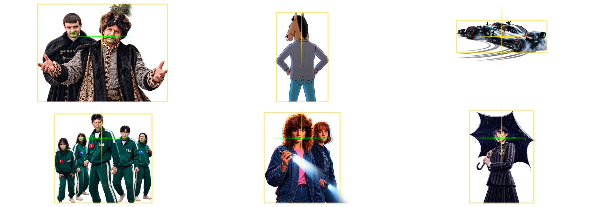
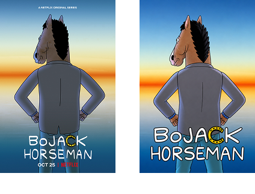

```widget
id: thumbnail-pipeline
```

## Кантекст

Платформа была B2B-агрэгатарам стрымінгу. Кожны тытул патрабаваў постараў пад любы макет: адна геаметрыя, каб сетка трымалася, некалькі скінаў, дзевяць прапорцый, і png, webp або progressive jpeg у large, medium, small і tiny — каб кожная паверхня магла мяняць якасць на хуткасць. Скін — гэта тытр плюс падкладка. Арыгінал захоўвае шрыфт фільма; агульны — адзін тытр на ўвесь каталог кліента.

Wednesday, Stranger Things, BoJack Horseman і астатнія тут — тытулы з каталога агрэгатара, не прадукт Netflix.

Каталог не стаяў. Падключаліся новыя правайдары; ужо падключаныя дадавалі прэм'еры. Пайплайн мусіў глядзець спачатку прадакшн, потым pre-release сырую базу: ранняя праца з сырымі данымі — тое, што не дае тытулу выйсці без постара.

## Намаганні

**Працягласць.** 1 год

**Роля.** Design Engineer

**Каманда.** Аднаасобна

### Абмежаванні

- Каталог рос ад новых правайдараў і прэм'ер
- Арыгіналы ад правайдара прыходзілі павольна і ў розных фарматах
- Раннія мадэлі збіваліся са стылю і не мелі роднай празрыстасці

### Што было складана

- Слаі з мадэлі не маюць агульнай сістэмы каардынат, таму змешаная сетка «п'яная», пакуль кожны пярэдні план не сядзіць на адных правілах
- Адзін агульны тытр, які чытаецца ў кішэні на адзін–тры радкі
- Белы тытр на светлым арце
- Дзе пакінуць чалавека: праход па слаях, потым QA па рэндэрах

## Працэс

fetch → parse → generate → crop → render → QA → upload

### Падцягнуць каталог

n8n спрацоўвае на змену ў базе і запускае дызайн-ланцуг. Прадакшн — прыярытэт; сырая база правайдара — другая. Апытанне ідзе па абедзвюх, з паўторам, пакуль новыя тытулы не трапяць у Workspace / RAW. Трымаць гэтую сырую базу актуальнай — тое, што не дае тытулу выйсці без постара.

### Разабраць рэферэнсы

Параўнанне каталога з лакальным сховішчам — і з'яўляецца to-do: тытулы без постара. Файлы правайдара дрэнна аўтаматызуюцца: павольна, кожны раз іншы фармат. Публічныя кадры пакрываюць большасць каталога: спачатку IMDb і Rotten Tomatoes; рэгіянальныя і нішавыя фільмы — з афіцыйнага сайта або пошуку выяў. Рэферэнсы жылі ў Obsidian.

### Згенераваць слаі

Кансістэнтнасць — адна і тая ж дэканструкцыя кожнага постара: пярэдні план (чалавек, жывёла, аб'ект), фон, унікальны тытр. Кожны слой мае ўласны промпт да рэферэнса — фон без надпісу і буйнога аб'екта; пярэдні план не абрэзаны, на празрыстым; тытр 2:1, таксама празрысты. Спачатку быў Gemini. Ён збіваўся са стылю, галюцынаваў і не меў альфы. Празрыстасць можна зрабіць скрыптам або Photoshop batch, але краі чысцейшыя, калі мадэль аддае яе сама. Перайшоў на GPT Images 2.0, калі з'явілася API. GPT запускае тры промпты паралельна; вынік кладзецца ў Workspace / Raw.

### Агульны тытр

Некаторым кліентам агрэгатара патрэбны быў адзін тытр на ўвесь каталог — больш кантрасту, герой трымае ўвагу. Складанае — запоўніць негатыўную прастору і падзяліць назву на адзін, два або тры радкі так, каб яна чыталася. Калі арыгінальны тытр чытэльны і ўжо ў адзін–тры радкі, OCR захоўвае гэты падзел. Калі зчытванне не ўдалося або назва даўжэйшая за тры радкі — Python-скрыпт дзеліць, потым агульны тытр генеруецца ў Workspace / Raw.

### Кроп і выраўноўванне

Фон і тытр — лёгкая праца: кроп (мадэлі часам пакідаюць белую рамку), водступ для тытра, рэсайз. Пярэдні план патрабуе кропкі цікавасці. Калі ёсць людзі — дэтэкт рота, бокс усіх ртоў, і гэты бокс на адной гарызанталі. Празрысты водступ кропіцца з якарам на роце. Без людзей: калі аб'ект ужо абрэзаны, вертыкальны крок прапускаецца; інакш выраўноўваецца на той жа гарызанталі. Потым кожны слой цэнтруецца па гарызанталі. Пераменная мінімальнага памеру твару кантралюе, наколькі буйны герой.



*Той жа кроп на кожным тытуле. Абрэзаныя аб'екты прапускаюць вертыкальны крок; потым усё цэнтруецца.*

### Рэндэр

Складае кожную патрэбную прапорцыю, памер, фармат, скін і імя файла. Фон заўсёды запаўняе кадр. Герой у цэнтры, без рэсайзу. Унікальны або агульны тытр — унізе па цэнтры; памяншаецца, калі кадр вузейшы за 1:1. Некаторыя скіны маюць падкладку — каляровы або чорны градыент для кантрасту тытра. Адценне з фону: маштаб да 9×9 і колер цэнтральнага пікселя. На светлым арце белае ўсё роўна правальваецца, таму пайплайн выбірае з 16 адценняў поўнага кола з тым жа кантрастам белага на колеры. Астатняе — Pillow.

### Лакальны AI QA

Дзве праверкі: колькі празрыстых пікселяў засталося ў тытры, і ці супадае рэндэр з рэферэнсам. Супадзенне — гэта герой, тытр і кроп, не факсіміле маркетынгавага кадра. Падлік пікселяў — проста. Параўнанне выяў не мусіць быць хуткім — Gemma 4 праз Ollama ішла ноччу, станцыя не прастойвала. У Obsidian — арыгінал і рэндэр плюс абодва балы. Сартаванне па бале само складае чаргу. Плагін запускае shell-скрыпт са сховішча, таму тая ж дошка — і панэль кіравання.



*Арыгінал і рэндэр. Той жа герой, тытр і кроп; пайплайн здымае Netflix-шыльду. Каталожны скін гучнейшы наўмысна.*

### Дастаўка праз watchfolder

Апошні крок самы просты, і яго таксама можна аўтаматызаваць. Watchfolder на рабочай папцы загружае, апавяшчае каманду ў Slack, сінхранізуе і робіць бэкап.

## Вынік

- Каля 30 000 арыгінальных тытулаў за год. Кожны тытул — 864 файлы: 8 скінаў × 9 прапорцый × 4 памеры × 3 фарматы (png, webp, progressive jpeg) — каля 26 мільёнаў файлаў
- Фрылансер, які дзяліў кадры на слаі і ставіў агульныя тытры, рабіў каля 1 000 тытулаў на месяц. Кансістэнтнасць тытраў ужо сыходзіла. Такім тэмпам 30 000 тытулаў — прыкладна два з паловай гады адной асобы, яшчэ да кампазіта скіна
- Кампазіт ніколі не замяралі. Джуніёр, які збірае нават малы набор прапорцый уручную, траціць хвіліны на тытул; 864 файлы на тытул — не план штату. Матрыца існуе, бо рэндэр — скрыпт
- На фоне гэтага фрылансера плюс джуніёра на кампазіт дызайнерскі час — ніжнія сотні тысяч еўра. 26 мільёнаў файлаў ёсць толькі таму, што апошнія крокі аўтаматычныя
