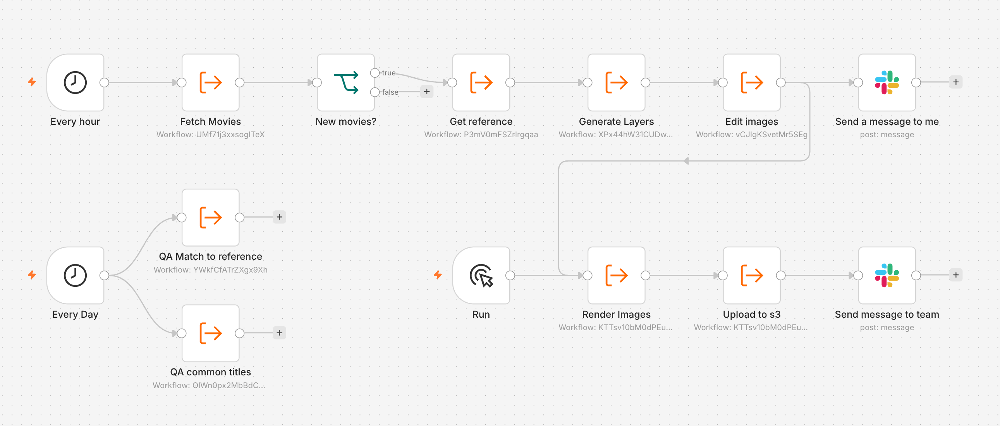
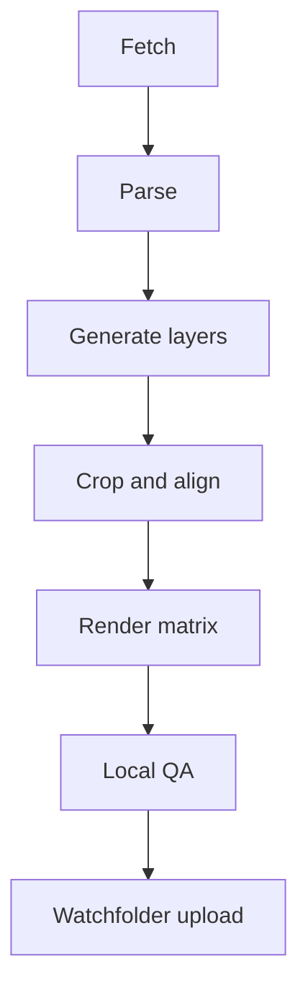
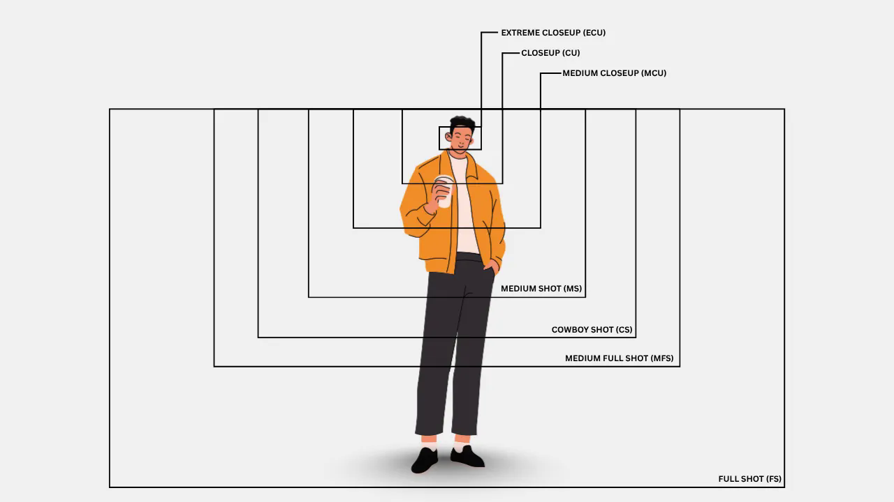

```widget
id: thumbnail-pipeline
```

## Context

The platform needed posters that behaved like one system across surfaces, not a collection of one-off illustrations. Each title shipped eight skins, nine aspect ratios, four sizes (large through tiny), and three formats — PNG, WebP, and progressive JPEG — with either the original title treatment or one common treatment across a customer's catalog. The problem was not making one poster; it was defining a geometry that survived every combination.

Wednesday, Stranger Things, and BoJack Horseman below are catalog titles from this aggregator, not a Netflix product.

The catalog moved constantly. New providers joined and existing ones added premieres, so the pipeline preferred production data and still had to parse pre-release dumps. A title going live without artwork was the failure mode.



*n8n runs the repeatable steps: hourly fetch and generation, a manual render-and-upload checkpoint, and daily QA.*

## Effort

**Duration.** 1 year

**Role.** Design Engineer

**Team.** Solo

### Constraints

- Provider originals arrived slowly, in mixed formats
- Early image models drifted in style and had no native transparency
- Generated layers shared no coordinate system
- Common titles had to stay legible in a one- to three-line pocket; white type needed contrast on bright art

### What required judgment

- Where to pause for humans: layer review and final QA, not the render matrix
- Shared anchors so mixed-aspect grids held together

*From catalog change to a delivered poster.*



## Process

### Detect missing titles

n8n listened for catalog changes and fired the chain when titles landed in Workspace / RAW. A diff against the local store produced the queue of missing posters. Production first, pre-release dumps second. When provider files were slow or inconsistent, public stills from IMDb, Rotten Tomatoes, and official sites filled the gap; references lived in Obsidian.

### Generate reusable layers

Each poster was the same three layers: background, foreground, and a transparent title at 2:1. Separate prompts made the layers reusable. Gemini drifted and had no native alpha — post-process masks were messier than asking the model. I moved to GPT Images 2.0 when the API shipped native transparency. Three layer requests ran in parallel into Workspace / Raw.

### Separate title logic from rendering

Some customers needed original title art; others needed one common treatment. Character art stayed center; the title filled negative space. If the original treatment already read across one to three lines, OCR kept that split. When the read failed or the name ran longer, a Python splitter broke the string before the common title was generated. Title extraction stayed separate from layout.

### Normalize composition

Background and title are light work: crop a leftover white border, add title margin, resize. Foreground needs a point of interest. The crop classifies the subject as a person or a face. A person stays at full scale, waist-up; a face gets a tighter frame.

To stop foregrounds from drifting, I detected mouths in human subjects, aligned their bounding box to a shared horizon, cropped transparent padding from that mouth anchor, then centered each layer horizontally. Already-cropped subjects without people skipped the vertical step. One face-size parameter controlled perceived scale — the same decision as shot scale, from a face close-up to a full figure.



*Shot scale is the crop: how much of the figure sits in the frame. [Types of shots in film](https://murphy.inc/types-of-shots-in-film-storyboarding/).*


*One anchor rule across different foregrounds: mouths share a horizon, then the layer is centered.*

### Render the output matrix

Pillow composed eight skins × nine ratios × four sizes × three formats from the same layers. The background filled the canvas; the character stayed centered; the title sat bottom-center and scaled on narrow ratios. To keep white type readable, the script sampled the center pixel of a 9×9 downscaled background and picked among 16 hues for a contrasting underlay gradient.

### QA and delivery

Two checks: leftover transparent pixels in the title, and a semantic match against the reference for character, title, and crop — not a pixel copy of the marketing still. Gemma 4 via Ollama ran the vision pass overnight on local memory. Obsidian showed the original, the render, and both scores side by side; a vault plugin launched the shell script. A watchfolder uploaded approved files, notified Slack, and triggered the backup sync. Human review stayed on layers, visual decisions, and edge cases.


*Reference versus render. The same character, title, and crop — without copying the Netflix branding. The catalog skin is louder on purpose.*

## Outcome

- About 30,000 original titles processed in one year
- 864 deliverables per title — 8 skins × 9 ratios × 4 sizes × 3 formats — roughly 26 million files
- A freelancer splitting stills and setting type by hand averaged about 1,000 titles a month; 30,000 titles would have taken two and a half years before any skin compositing
- Human attention moved to art direction, layer decisions, and exceptions — not manual scaling
