## Context

The platform was a B2B streaming aggregator. Every title needed posters that could land in any layout: the same geometry so the grid held together, several skins, several aspect ratios, and png, webp, or progressive jpeg at big, medium, small, and tiny — so each surface could trade quality for speed.

The catalog never stood still. New providers joined; ones already on the pipe dropped premieres. Manual fetch was too slow. The chain had to watch production first and the pre-release dump second: work on raw data early is what stops missing posters when a title goes live.
## Effort

**Duration.** 1 year

**Role.** Design Engineer

**Team.** Solo

### Constraints

- Catalog grew from new providers and premieres
- Provider originals arrived slowly, in mixed formats
- Public catalogs sat behind Cloudflare
- Early image models drifted in style and had no native transparency

### What was hard

- Same crop and geometry rules across tens of thousands of titles
- Titles fitted into one, two, or three lines of negative space
- Faces on one horizon, silhouettes centered
- Type readable on bright art

*From catalog change to delivery.*

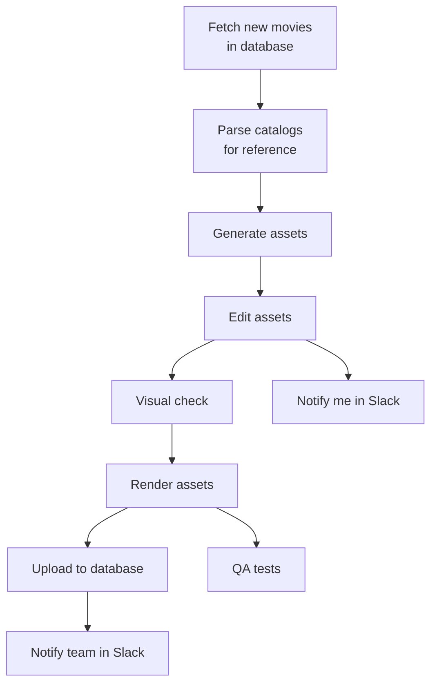

## Process

### Fetch the catalog

n8n fires on a database change and runs the design chain. Production is the priority; the raw provider dump is secondary. Keeping that raw base current is what prevents a title from shipping without a poster.

*Poll production and pre-production; retry until new titles land in Workspace / RAW.*

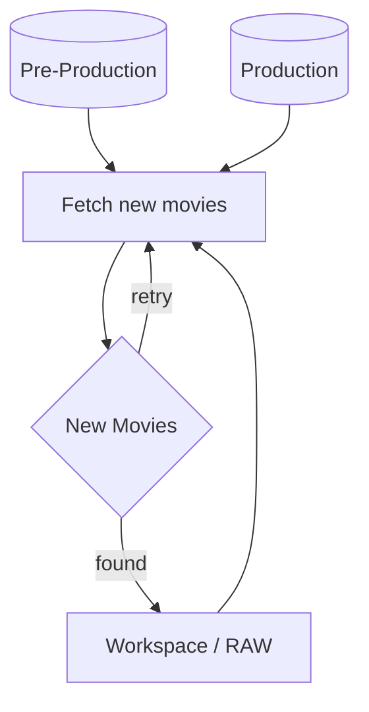

### Gather references

Diff the catalog against the local store and the to-do list appears: titles with no poster. Provider files were a poor automation source — slow, a different format every time. Public stills first: IMDb and Rotten Tomatoes cover most of the catalog; region-specific and niche films come from the official site or image search. Playwright died on Cloudflare. Chrome CDP, with one human pass per session, did not. References lived in Obsidian.

*Poster fallback: IMDB, official site, then Google Images.*

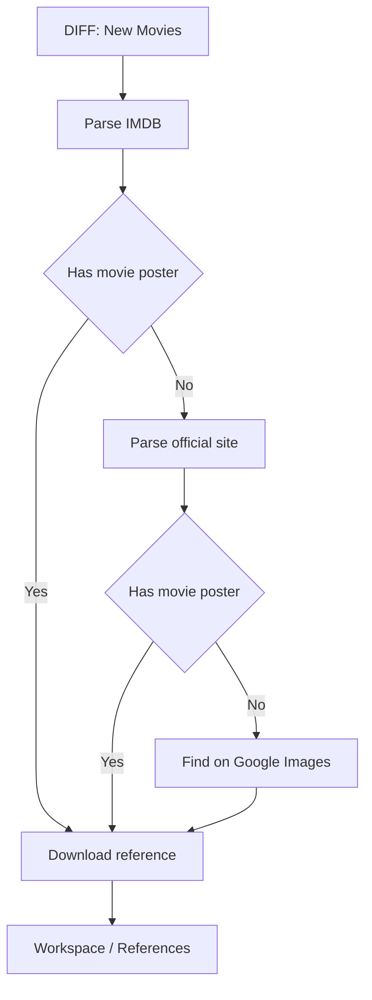

### Generate layers

Consistency is the same deconstruction on every poster: foreground (person, animal, object), background, unique title. Each layer has its own prompt on the reference — background without type or a large subject; foreground uncropped on transparent; title at 2:1, also transparent. Gemini (Nano Banana) was first. It drifted, hallucinated, and had no alpha. Transparency can be faked in a script or a Photoshop batch, but edges are cleaner when the model emits it. Switched to GPT Images 2.0 when the API shipped.

*Parallel GPT generation of background, character, and unique title.*

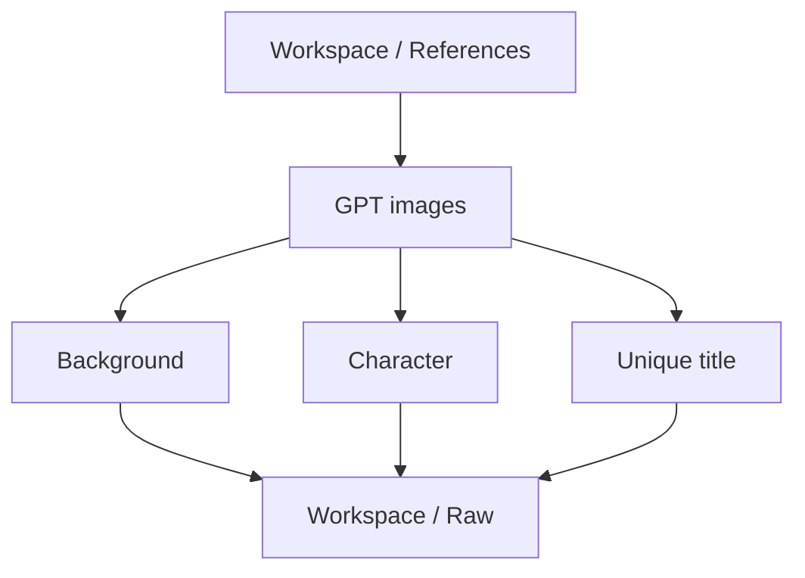

### Common titles

Some customers wanted one title treatment across the catalog — more contrast, the character does the talking. The hard part is filling negative space and splitting the name across one, two, or three lines so it reads. If the original title art is readable, OCR keeps that split. If it is not, a Python splitter does the job.

*Read the title from the reference; split when it runs past three strings.*

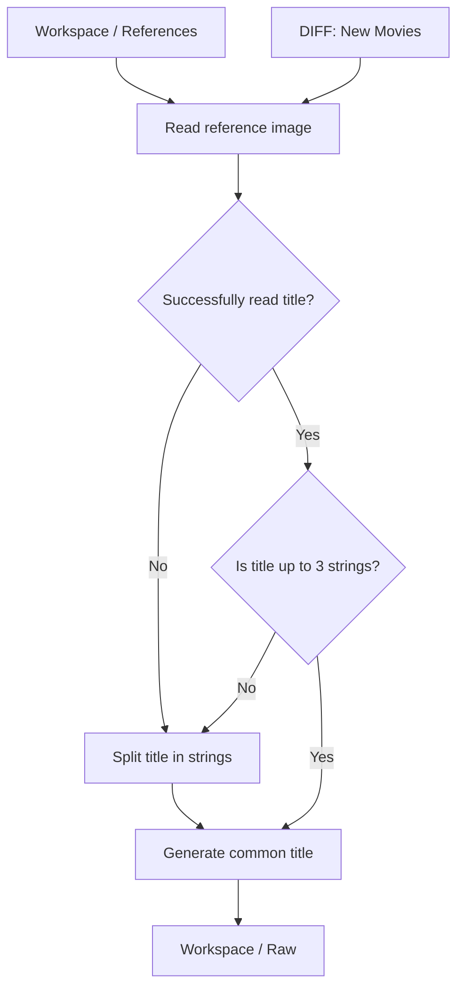

### Tune the layers

Background and title are light work: crop (models sometimes leave a white border), add title margin, resize. Foreground needs a point of interest. Detect face and silhouette. All faces on one horizontal line; silhouettes in the center of the frame. Crop from those points with as little loss as possible. A minimum face-size variable controls how large the character sits.

*Resize background and title into Workspace / Raw.*

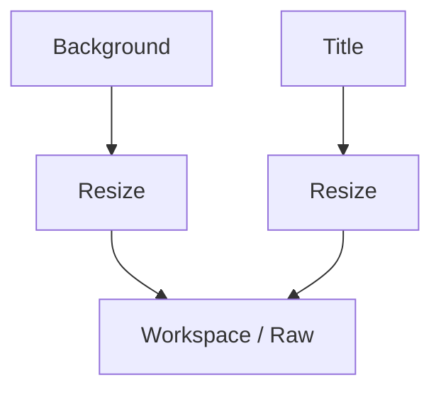

*Crop the character to face and body bounds.*

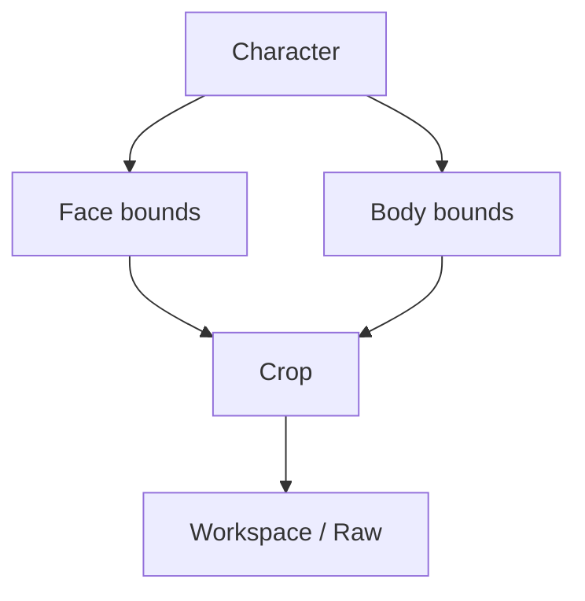

### Render

Composite every required ratio, size, format, skin, and filename. Background always fills. Character pastes in the center, never resized. Unique or common title sits bottom-center, and scales down when the frame is thinner than 1:1. Some skins get an underlay — a colored or black gradient for title contrast. Hue comes from the background: scale to 9×9 and read the center pixel. Bright art still fails white-on-light, so the pipeline picks among 16 hues on a full cycle that keep the same white-on-color contrast. Pillow does the rest.

*Each render walks aspect ratio, format, size, and skin.*

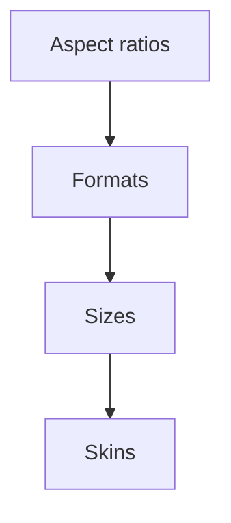

*Canvas compose with underlay, title, and branding branches. Character stays centered and is never resized.*

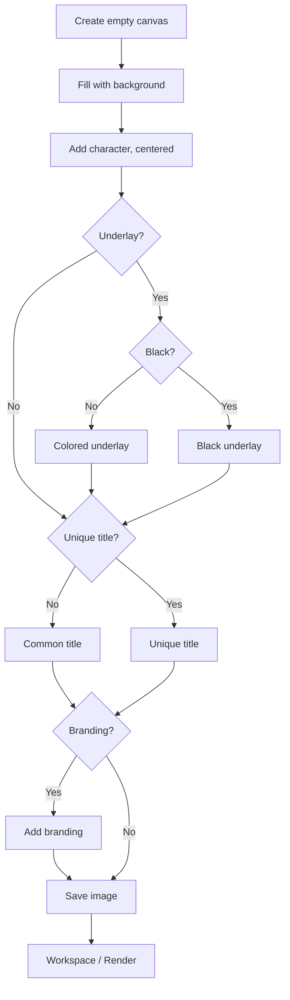

```widget
id: thumbnail-pipeline
```

### Local AI QA

Two checks: leftover transparent pixels in the title, and whether the render still matches the reference. Pixel counting is cheap. Image compare does not need to be fast — Gemma 4 via Ollama ran overnight, so the workstation never sat idle. Obsidian showed original vs render plus both scores. Sort the score column and the queue orders itself. A plugin runs a shell script from the vault, so the same board is the control panel.

*Rendered poster vs reference via Gemma4.*

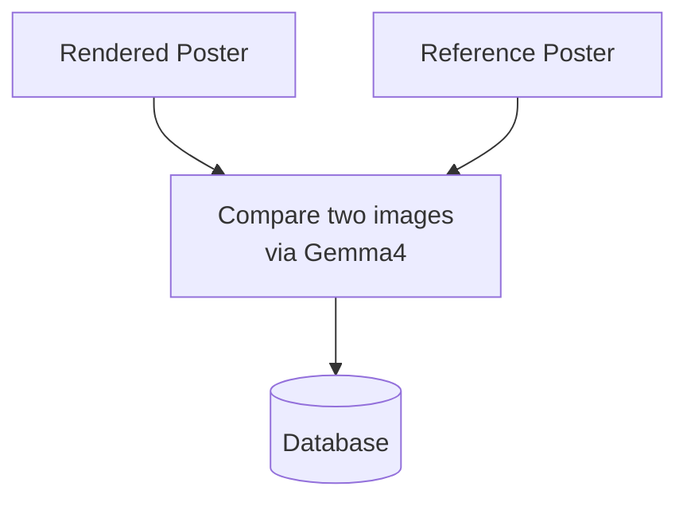

*Transparent-pixel count on the common title.*

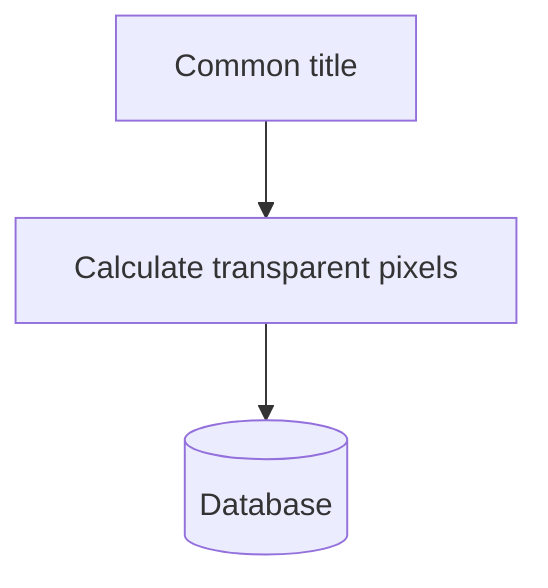

### Watchfolder delivery

The last hop is the easy one, and it can still be automatic. A watchfolder on the working directory uploads, notifies, syncs, and backs up.

## Solution

RAW layers keyed by movie ID. Renders named by skin, ratio, and size. References and QA scores live in the Obsidian vault.

*Raw layers keyed by movie ID.*

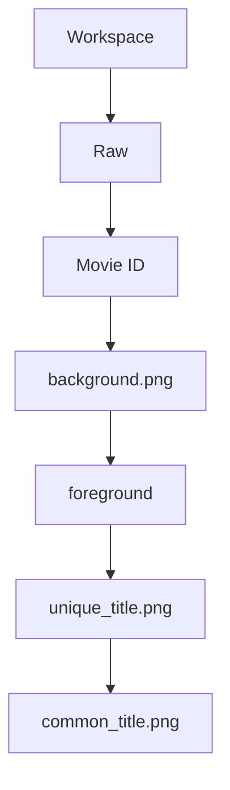

*Obsidian vault: renders named by skin, ratio, and size; references by movie ID.*

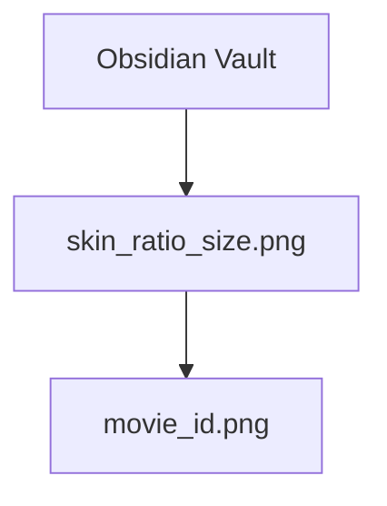

*Vault database fields for titles, posters, and QA scores.*

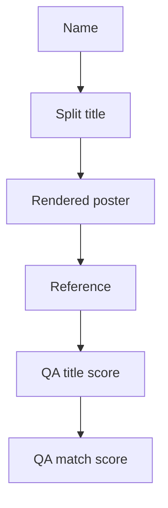

## Impact

- Nearly 30,000 thumbnails in one year
- Hundreds of thousands of euros saved
- Catalog changes run the full chain without a manual fetch
