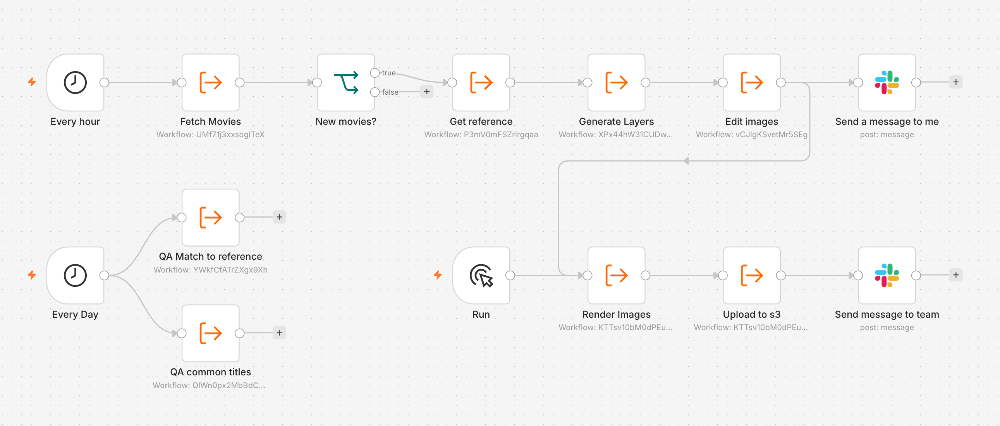
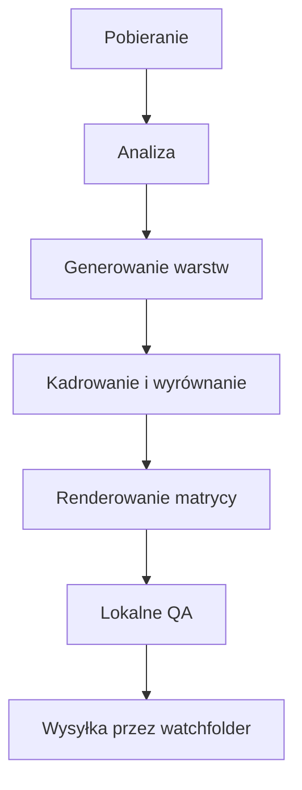
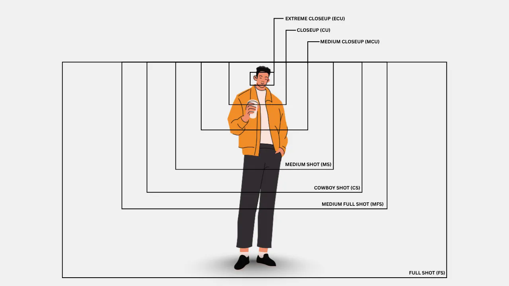
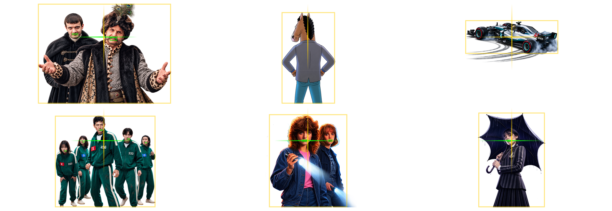
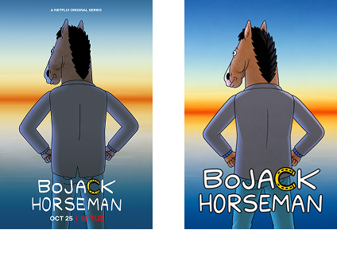

```widget
id: thumbnail-pipeline
```

## Kontekst

Platforma potrzebowała plakatów działających jako spójny system na wielu powierzchniach, a nie zbioru jednorazowych grafik. Każdy tytuł wymagał przygotowania w ośmiu wariantach (skórkach), dziewięciu proporcjach boków, czterech rozmiarach (od dużego po miniaturowy) oraz trzech formatach — PNG, WebP i progresywnym JPEG — z oryginalnym liternictwem tytułu lub wspólnym stylem dla całego katalogu klienta. Wyzwaniem nie było stworzenie pojedynczego plakatu, lecz zdefiniowanie reguł geometrii, które sprawdzą się w każdej możliwej kombinacji.

*Wednesday*, *Stranger Things* i *BoJack Horseman* poniżej to przykładowe pozycje z katalogu agregatora, a nie bezpośredni produkt Netflixa.

Katalog zmieniał się nieustannie. Dołączali nowi dostawcy, a dotychczasowi dodawali premiery, dlatego potok preferował dane produkcyjne, musząc równocześnie przetwarzać zrzuty przedpremierowe. Publikacja tytułu bez grafiki była niedopuszczalna.



*n8n wykonuje powtarzalne kroki: cogodzinne pobieranie i generowanie, ręczny punkt kontrolny renderu i wysyłki oraz codzienne QA.*

## Wkład

**Czas trwania.** 1 rok

**Rola.** Design Engineer

**Zespół.** Samodzielnie

### Ograniczenia

- Materiały źródłowe od dostawców docierały z opóźnieniem i w różnych formatach
- Wczesne modele generatywne cechowały się niestabilnością stylu i brakiem przezroczystości alfa
- Wygenerowane warstwy nie posiadały wspólnego układu współrzędnych
- Tytuły w stylu wspólnym musiały zachować czytelność w układzie od jednej do trzech linii; biała typografia wymagała odpowiedniego kontrastu na jasnych tłach

### Co wymagało decyzji projektowej

- Identyfikacja etapów wymagających kontroli człowieka: weryfikacja warstw i końcowe QA zamiast ręcznego renderowania matrycy wariantów
- Ustalenie wspólnych punktów odniesienia (kotwic), aby siatka z różnymi proporcjami zachowywała spójność

*Od zmiany w katalogu po dostarczony plakat.*



## Proces

### Wykrywanie brakujących tytułów

n8n nasłuchiwał zmian w katalogu i uruchamiał przepływ, gdy tytuły trafiały do folderu Workspace / RAW. Porównanie z lokalną bazą generowało kolejkę brakujących grafik. Priorytet miały zasoby produkcyjne, a następnie pakiety przedpremierowe. Gdy materiały dostawców były opóźnione lub niepełne, brakujące kadry uzupełniano kadrami z IMDb, Rotten Tomatoes i stron oficjalnych; referencje gromadzono w Obsidianie.

### Generowanie warstw wielokrotnego użytku

Każdy plakat składał się z tych samych trzech warstw: tła, pierwszego planu oraz przezroczystego tytułu w proporcji 2:1. Osobne prompty zapewniały możliwość ponownego wykorzystania warstw. Wczesne modele Gemini dryfowały stylistycznie i nie posiadały natywnego kanału alfa — maskowanie post-factum było zbyt zawodne. Przeszedłem na GPT Images 2.0, gdy API wprowadziło natywną przezroczystość. Zapytania o trzy warstwy były wykonywane równolegle do folderu Workspace / Raw.

### Rozdzielenie logiki tytułu od renderowania

Część klientów wymagała oryginalnej oprawy typograficznej, inni ujednoliconego stylu w całym katalogu. Postać pozostawała w centrum, a tytuł wypełniał przestrzeń negatywną. Jeśli oryginalny tytuł mieścił się w 1–3 wierszach, moduł OCR zachowywał ten podział. W razie niepowodzenia odczytu lub długiej nazwy, skrypt w Pythonie dzielił ciąg znaków przed wygenerowaniem wspólnego tytułu. Ekstrakcja tytułu pozostała niezależna od układu graficznego.

### Normalizacja kompozycji

Tło i tytuł to proste operacje: usunięcie resztek białych ramek, dodanie marginesu, skalowanie. Pierwszy plan wymagał punktu centralnego. Kadr klasyfikował obiekt jako postać lub twarz. Sylwetka postaci była kadrowana od pasa w górę, a twarz otrzymywała ciaśniejszy kadr.

Aby zapobiec dryfowaniu pierwszego planu, zaimplementowałem detekcję ust u postaci, wyrównanie ich ramki ograniczającej do wspólnej linii horyzontu, odcięcie przezroczystości od tego punktu i poziome wycentrowanie warstwy. Wykadrowane obiekty bez postaci omijały krok wertykalny. Parametr rozmiaru twarzy kontrolował postrzeganą skalę ujęcia — od zbliżenia po pełny plan.



*Skala ujęcia w kadrze: ile postaci mieści się w kadrze. [Typy planów filmowych](https://murphy.inc/types-of-shots-in-film-storyboarding/).*



*Jedna reguła punktu kotwiczenia dla różnych postaci: usta dzielą linię horyzontu, a cała warstwa jest centrowana.*

### Renderowanie matrycy wyjściowej

Biblioteka Pillow składała osiem skórek × dziewięć proporcji × cztery rozmiary × trzy formaty z tych samych warstw. Tło wypełniało obszar roboczy, postać pozostawała w centrum, a tytuł trafiał na dół i skalował się w węższych proporcjach. Aby zachować czytelność białego tekstu, skrypt próbkował centralny piksel zminiaturyzowanego tła 9×9 i dobierał jeden z 16 odcieni dla kontrastowego gradientu podkładowego.

### Kontrola jakości i dostawa

Dwa testy: brak pozostałości przezroczystych pikseli w tytule oraz semantyczna zgodność z referencją dla postaci, tytułu i kadru — z naciskiem na spójność, a nie kopiowanie 1:1 fotosów promocyjnych. Model Gemma 4 przez Ollama realizował analizę wizualną nocą w pamięci lokalnej. Obsidian prezentował oryginał, render i oceny obok siebie, a wtyczka uruchamiała skrypt powłoki. Folder automatyczny (watchfolder) przesyłał zatwierdzone pliki, wysyłał powiadomienie na Slacku i uruchamiał kopię zapasową. Człowiek skupiał się wyłącznie na ocenie artystycznej warstw i nietypowych przypadkach.



*Referencja i render. Ta sama postać, tytuł i kadr — bez powielania brandingu Netflixa. Skórka katalogowa jest celowo bardziej wyrazista.*

## Rezultaty

- Około 30 000 oryginalnych tytułów przetworzonych w ciągu jednego roku
- 864 pliki na tytuł — 8 skórek × 9 proporcji × 4 rozmiary × 3 formaty — łącznie około 26 milionów wygenerowanych plików
- Freelancer ręcznie dzielący kadry i składający typografię przetwarzał średnio 1 000 tytułów miesięcznie; opracowanie 30 000 pozycji zajęłoby 2,5 roku przed jakimkolwiek etapem wariantowania skórek
- Uwaga człowieka została przekierowana na kierownictwo artystyczne, decyzje dotyczące warstw i wyjątki — eliminując powtarzalne skalowanie
